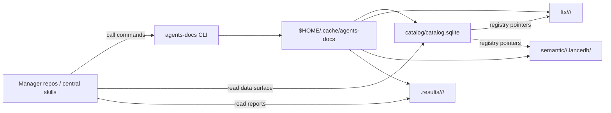
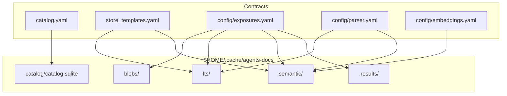

# agents-cli

Reusable local document tooling for agent workflows. The first public surface is
`agents-docs`, a CLI for building and querying a regenerable document corpus
cache.

`agents-docs` owns the implementation for inventory, Docling parsing, SQLite
catalog control, Tantivy FTS indexes, LanceDB semantic stores, refresh behavior,
health checks, and structured command reports. Manager repositories and central
skills call the CLI; they do not implement the lower indexing internals.

Dependency rationale is documented in [docs/dependencies.md](./docs/dependencies.md).

## Current Status

This repository is moving from specification into implementation. The package
skeleton, fixed-cache catalog creation/migration, catalog status, health
commands, and folder inventory are implemented. Heavy runtime behavior such as
Docling parsing and index building lands in later phases.

## Install Shape

The package name is `agents-cli`; the console script is `agents-docs`.

Optional dependency groups are defined in [pyproject.toml](./pyproject.toml):

| Extra | Purpose |
| --- | --- |
| `docling` | Docling parsing. |
| `fts` | Tantivy full-text indexes. |
| `semantic` | LanceDB, PyArrow, and NumPy. |
| `embeddings` | FastEmbed local embeddings. |
| `heavy-embeddings` | SentenceTransformers local embeddings. |
| `all` | Practical full local stack. |

## Fixed Cache

The cache root is intentionally not configurable:

```text
$HOME/.cache/agents-docs/
```

The catalog is always:

```text
$HOME/.cache/agents-docs/catalog/catalog.sqlite
```

There is no `init` command. Producer commands call centralized table creation
before writing. `catalog create` creates the fixed catalog when it is missing,
and `catalog migrate` upgrades an existing stale or incomplete catalog.

## Binding CLI Surface

Commands are intentionally shallow: first command plus optional subcommand.
Cache path, profiles, traversal defaults, index defaults, and safeguards come
from config files rather than command arguments.

| First command | Subcommand | Mandatory args | Output | Purpose |
| --- | --- | --- | --- | --- |
| `catalog` | `create` | none | JSON | Create the fixed home catalog if it is missing. |
| `catalog` | `migrate` | none | JSON | Upgrade an existing stale or incomplete fixed home catalog. |
| `catalog` | `status` | none | JSON | Report catalog presence, version, expected tables, missing tables, and row counts. |
| `health` | none | none | JSON | Check fixed paths and available runtime dependencies. |
| `scan` | `folder <path>` | `path` | JSON | Inventory a folder tree and record source items. |
| `parse` | `folder <path>` | `path` | JSONL planned | Parse folder-tree sources through Docling and record artifacts/objects. |
| `index` | `folder <path>` | `path` | JSON/JSONL planned | Build or refresh FTS and semantic islands for a folder root. |
| `search` | `text <query>` | `query` | JSONL planned | Search built lower-index islands and hydrate through SQLite. |

Minimal examples:

```powershell
agents-docs catalog create
agents-docs catalog migrate
agents-docs catalog status
agents-docs health
agents-docs scan folder "C:\docs\example-folder"
agents-docs parse folder "C:\docs\example-folder"
agents-docs index folder "C:\docs\example-folder"
agents-docs search text "contract renewal clause"
```

`scan folder` accepts optional safeguard overrides only when a caller needs to
exceed configured defaults: `--max-files`, `--max-bytes`, and `--max-depth`.
It writes `source_roots`, `source_items`, and a root `index_scopes` row, then
writes `result.json` and `events.jsonl` under `.results/`.

## CLI And Data Surfaces

Upper layers interact with this project through two separate surfaces:

- **CLI surface**: commands that create, refresh, index, search, and report.
- **Data surface**: generated SQLite/catalog state, lower index islands, result
  files, and schema/template contracts.



The CLI is the write/control surface. Consumers may read the generated SQLite
catalog directly for data access.

## Data Contracts

Review these files for the binding data surface:

| File | Purpose |
| --- | --- |
| [catalog.yaml](./catalog.yaml) | Current-state SQLite catalog schema. |
| [store_templates.yaml](./store_templates.yaml) | Generated Tantivy/LanceDB row templates. |
| [config/exposures.yaml](./config/exposures.yaml) | Fixed cache root, path templates, exposure kinds, blob storage defaults. |
| [config/parser.yaml](./config/parser.yaml) | Parser profiles, traversal defaults, index defaults, safeguards. |
| [config/embeddings.yaml](./config/embeddings.yaml) | Embedding profile config. |
| [specifications/corpus-cache-cli/spec.md](./specifications/corpus-cache-cli/spec.md) | Durable CLI and data contract. |



## Workflow

Repository workflow rules are in [WORKFLOW.md](./WORKFLOW.md). Current work is
tracked in [plans/2026-06-04-docling-search-index](./plans/2026-06-04-docling-search-index/).
