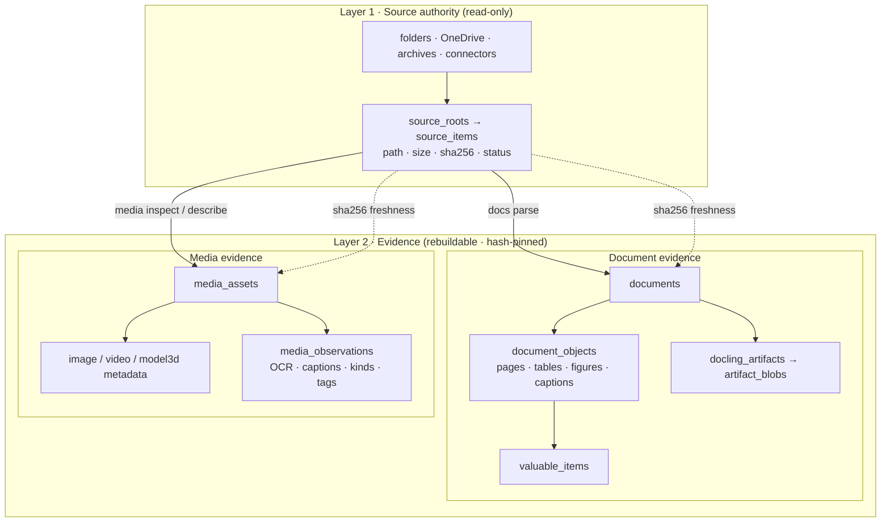
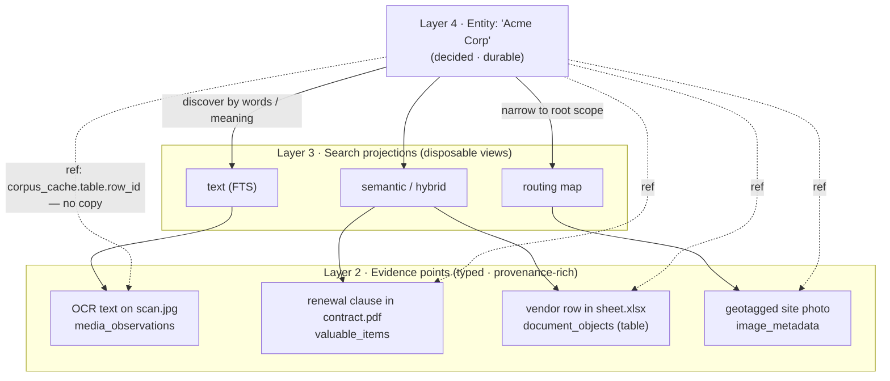

# Evidence Engine

Reusable local evidence engine for document and generic media workflows.

Evidence Engine owns the public mechanics for source inventory, document
parsing, generated artifacts, SQLite catalog state, text search, semantic
search, hybrid search, command result files, and provenance-rich evidence
references. Private workspaces consume this open local data; they do not
reimplement lower extraction or search internals.

The name reflects the layering: a *corpus* of mixed local files, turned into
provenance-backed *evidence*, exposed as a lower *stack* layer that private
knowledge workspaces build on top of. The installable package and console
script remain `even` (see [Install Shape](#install-shape)).

## Layered Architecture

The system is a five-layer stack. A *layer* is a band; it can hold several
boxes. Each layer only describes what the layer below produced — meaning is
added on the way up, never assumed at the bottom:

```text
5  Curated knowledge     [ markdown notes · conventions · handoff slices ]   ▲ meaning
4  Reviewed facts        [ entities · classifications · links · decisions ]  │
3  Search projections    [ text (FTS) · semantic (vector) · hybrid · routing ]
2  Evidence              [ inventory · parsed objects · OCR/captions/summaries ]
1  Source authority      [ folders · OneDrive · archives · connectors ]      ▼ evidence
```

`even` **produces layers 2–3** from the layer-1 sources. **Layers 4–5 are
written by workspaces on top** (`private-documents`, `private-media`). There are
**no access boundaries**: every layer is open data the layer above reads
directly, plus one search API. The dependency direction is one-way — upper
layers know lower ones, never the reverse.

| # | Layer | Boxes inside | Catalog tables | Built by |
| --- | --- | --- | --- | --- |
| 1 | **Source authority** | Original files/connectors, read-only. Paths are private; only schemas are public. | `source_roots` | `sources scan` |
| 2 | **Evidence** | Everything machine-produced and **rebuildable**: source inventory, parsed typed objects (documents, pages, tables, figures, images, blobs), and generated observations (OCR text, captions, shallow descriptions). *Never proof of absence.* | `source_items`, `source_root_stats`, `source_extension_stats`, `documents`, `docling_artifacts`, `artifact_blobs`, `document_objects`, `valuable_items` | `docs parse` |
| 3 | **Search projections** | Fast rebuildable retrieval indexes: text (FTS), semantic (vector), hybrid fusion, and global routing. | `index_scopes`, `summary_nodes`, `fts_indexes`, `semantic_stores` | `index scope`, `index routing`, `search` |
| 4 | **Reviewed facts** | Meaning a human or agent **decided**: entities, classifications, identities, relationships, promotion choices. Durable; carries judgment. | *(upper catalog)* | workspaces on top |
| 5 | **Curated knowledge** | Human-readable Markdown: conventions, decisions, selected facts, topic handoff slices. | *(markdown)* | workspaces on top |

The two middle layers carry the load, so their scope is explicit:

- **Layer 2 — Evidence** is *rebuildable from sources + config + hashes*. No
  human judgment lives here; it can always be regenerated.
- **Layer 4 — Reviewed facts** is *decided and durable*. It is not regenerable
  and must never be overwritten by a re-parse.

The **SQLite catalog** is the current-state spine of layers 1–3. Layers stitch
together through plain catalog references — `corpus_cache.<table>.<row_id>`,
the same `ref:` convention the catalog uses for its own foreign keys — so an
upper row or a search hit points at exact evidence **without copying it**. See
the [Reference Contract](./specifications/corpus-cache-cli/spec.md#reference-contract).

Search is the one surface accessed through the CLI/API rather than direct reads,
because the physical text/vector internals stay hidden behind `text`,
`semantic`, and `hybrid`.

> The five bands are a mental model, not the precise data flow — indexing in
> particular touches several layers. They pack the real complexity into
> something a mind can stack.

## The Evidence Layer — the Novel Core

Most local search tools flatten a corpus into one index and lose the path back
to the original bytes. Evidence Engine keeps that path. **Layer 2 is the
engine's center of gravity:** a *typed, provenance-backed* evidence layer where
every machine-produced observation is

- **typed, not flattened** — a clause, a table cell, an OCR line, and a caption
  stay distinct objects with reading order, page span, and bbox, instead of
  being dissolved into anonymous text chunks;
- **rebuildable and hash-pinned** — each row carries its source `sha256`, so it
  can always be regenerated from Layer 1 and never drifts from the bytes it
  describes;
- **never proof of absence** — a missing observation means "not yet extracted,"
  not "does not exist";
- **referenced, not copied** — everything above points *into* this layer by
  `ref: corpus_cache.table.row_id`, so meaning accrues without duplicating
  evidence.

The diagram below shows Layer 2 in detail and how it hangs off the read-only
Layer 1 inventory. Documents and media are two parallel evidence branches that
share the same blob store and the same freshness contract.



## Binding Reviewed Facts to Evidence

The payoff of a typed evidence layer is what Layer 4 can do with it. A single
**reviewed fact** — an entity, identity, or decision — can gather *many kinds of
evidence under one identity*. It reaches that evidence two ways:

- **discovery** — find candidate evidence by words (FTS), by meaning (semantic /
  hybrid), or by narrowing to the right root scope first (routing);
- **binding** — pin the accepted hits by `ref:` directly to the underlying
  evidence rows, with no copy, so the entity keeps an exact, regenerable trail.

So one entity can simultaneously hold an OCR line read off a scanned image, a
clause inside a parsed contract, a row in a spreadsheet table, and a geotagged
site photo — heterogeneous evidence types, one identity, every link
provenance-checkable.



Layer 5 (curated Markdown) sits one step further out and belongs mostly to
workspaces that consume `even`; it is intentionally kept low-profile here.

## Current Status

This repository is in beta/pre-development. There is no backward-compatibility
burden for the older `agents-docs` command or old generated catalogs. Generated
workspace state may be wiped and rebuilt while the public contract settles.

Implemented today:

- package and CLI entrypoint named `even`;
- workspace-local storage under `.cache/even/`;
- SQLite catalog create/status/wipe;
- media-aware source inventory through `sources scan` (documents, images, video, audio, 3D);
- Docling parsing through `docs parse`;
- deterministic image, video, and 3D (OBJ/STL) metadata through `media inspect`;
- visual search (image→image and text→image) via SigLIP 2 image embeddings;
- media captions/metadata indexed into text/semantic search so media is findable by words;
- text, semantic, and hybrid search/index plumbing;
- document root summaries, media album summaries, and fixed-path global
  representative FTS routing for `search text`;
- JSON-first command stdout;
- persisted result JSON, events, summaries, and optional HTML reports.

## Install Shape

The brand is **Evidence Engine**. The package name is
`even`; the console script is `even` (ev-idence en-gine).

Optional dependency groups are defined in [pyproject.toml](./pyproject.toml).
Plain `uv sync` installs the `laptop` stack by default.

| Extra | Purpose |
| --- | --- |
| `docling` | Docling parsing. |
| `fts` | Full-text search implementation. |
| `semantic` | Vector store, PyArrow, and NumPy. |
| `embeddings` | FastEmbed local embeddings. |
| `heavy-embeddings` | SentenceTransformers local embeddings. |
| `media` | Image/video/3D metadata, thumbnails, perceptual hashing. |
| `image-search` | SigLIP 2 image embeddings for visual search. |
| `laptop` | Full local CPU stack (docling + fts + semantic + embeddings + media). Installed by default `uv sync`. |
| `station` | `laptop` plus heavier models (SentenceTransformers). |
| `all` | Alias of `station`. |

## Workspace Storage

Generated data is written under the caller workspace:

```text
.cache/even/
  catalog/catalog.sqlite
  blobs/
  fts/
  semantic/
  models/fastembed/
  results/
  reports/
```

This avoids one shared home-cache result/report tree. Real generated data is
private even when the code and schema files are public.

There is no V1 migration contract for old beta catalogs. Use
`even catalog wipe` and rebuild when the schema changes during
this phase.

## CLI Surface

Commands return JSON on stdout. Commands that perform larger work also write
`result.json`, `events.jsonl`, and `summary.md` under the workspace
`results/` tree. `--report` writes optional HTML under `reports/`.

| Command | Subcommand | Mandatory args | Purpose |
| --- | --- | --- | --- |
| `catalog` | `create` | none | Create the workspace catalog if missing. |
| `catalog` | `status` | none | Report catalog presence, version, table state, and row counts. |
| `catalog` | `wipe` | none | Delete the workspace catalog database. |
| `health` | none | none | Check workspace paths and optional dependencies. |
| `sources` | `scan <path>` | `path` | Inventory a mixed-content folder tree (documents, images, video, audio, 3D models). |
| `docs` | `parse <path>` | `path` | Auto-scan and parse documents through Docling. |
| `media` | `inspect <path>` | `path` | Extract image metadata (size, EXIF, GPS) and thumbnails into the catalog. |
| `media` | `describe <path>` | `path` | Shallow VLM captions (and optional `--kind`) via a local Ollama model. Opt-in, read-only. |
| `media` | `dedupe <path>` | `path` | Near-duplicate image candidate pairs via perceptual hashing (no model). |
| `index` | `scope <path>` | `path` | Build or refresh the text index for a source scope. |
| `index` | `scope <path> --semantic` | `path` | Build or refresh the semantic index for a source scope. |
| `index` | `scope <path> --image` | `path` | Build or refresh the image-embedding store for media images (needs `image-search` extra). |
| `index` | `routing <path>` | `path` | Build or refresh document/media summaries and the global representative FTS map. |
| `search` | `text <query>` | `query` | Search current text indexes. |
| `search` | `semantic <query>` | `query` | Search current semantic indexes. |
| `search` | `hybrid <query>` | `query` | Search text and semantic indexes with RRF fusion. |
| `search` | `image <image-path>` | `image-path` | Visual search: image→image (or `--text` for text→image) over image embeddings. |

Minimal examples:

```powershell
even catalog create
even catalog status
even health
even sources scan "C:\docs\example-folder"
even docs parse "C:\docs\example-folder"
even media inspect "C:\docs\example-folder"
even index scope "C:\docs\example-folder"
even index scope "C:\docs\example-folder" --semantic
even index routing "C:\docs\example-folder"
even search text "contract renewal clause"
even search semantic "contract renewal clause"
even search hybrid "contract renewal clause"
```

`sources scan` accepts optional safeguard overrides when a caller needs to
exceed configured defaults: `--max-files`, `--max-bytes`, and `--max-depth`.
Add `--report` for an HTML inventory report.

`docs parse` auto-runs the catalog and source-scan prerequisites. It defaults
to `docling_ocr`; use `--profile docling_fast_text` for a faster non-OCR run.
Parse failures are classified into actionable categories and included in
result JSON, Markdown summaries, and optional HTML reports.

`media inspect` auto-scans, then extracts deterministic metadata into typed
catalog tables, dispatched by media class: images (dimensions, color mode, EXIF
camera/orientation/GPS, capture time, plus a thumbnail through the shared blob
store), video (container, codecs, resolution, duration, frame rate, bit rate),
and 3D models (vertex/face counts and bounding box for OBJ and STL). It runs no
model. The model-based `describe`/`dedupe` commands follow in later slices.

`index scope` builds the text index from current parsed document objects **and
media text** (captions, media-kind, and filenames), so media shows up in
`search text`, `semantic`, and `hybrid` alongside documents. It auto-scans the
source path but does not silently parse/OCR missing documents. Run `docs parse`
and/or `media inspect`/`describe` first. Add `--semantic` for the semantic
index or `--image` for the image-embedding store.

`index routing` builds lossy document root summaries and media album summaries
into `summary_nodes`, then projects current summaries into a fixed global
representative FTS map. Media summaries use existing filenames, media metadata,
and caption/kind observations; they do not add OCR, transcripts, keyframes, or
object detection. Summary generation uses a local Ollama endpoint and is
explicit so ordinary `index scope` stays model-free. The global map is a routing
hint only; evidence still comes from root-scoped FTS hits.

`search text`, `search semantic`, and `search hybrid` are the public search
surface. Higher layers should not know which physical search engine backs
those projections. When a current global representative map exists,
`search text` routes to likely root scopes first and falls back to all current
FTS indexes when routing is unavailable or weak.

## Public Data Contract

The public contract is open local data plus search access:

| Surface | Purpose |
| --- | --- |
| [catalog.yaml](./catalog.yaml) | Current-state SQLite schema. |
| `.cache/even/catalog/catalog.sqlite` | Readable local catalog database. |
| [store_templates.yaml](./store_templates.yaml) | Generated text/semantic row templates. |
| [config/exposures.yaml](./config/exposures.yaml) | Workspace storage layout. |
| [config/parser.yaml](./config/parser.yaml) | Parser, traversal, indexing, and safeguard defaults. |
| [config/embeddings.yaml](./config/embeddings.yaml) | Embedding profile config. |
| [config/routing.yaml](./config/routing.yaml) | Global representative routing defaults. |
| `results/` | Run proof: JSON, JSONL events, and Markdown summaries. |
| `reports/` | Optional human HTML reports. |
| Search CLI | Hydrated text/semantic/hybrid retrieval without exposing projection internals. |

Private repositories may open the SQLite database read-only and query it
directly. Search is intentionally accessed through the CLI/API because text and
vector projection internals are implementation details.

## Public And Private Split

Public repo material:

- code;
- schemas;
- empty/synthetic config examples;
- migration/reset logic during development;
- synthetic fixtures;
- contract documentation.

Private or generated material:

- real source manifests and paths;
- generated SQLite catalogs;
- OCR text and parser artifacts;
- generated descriptions and thumbnails;
- text/vector indexes;
- embeddings;
- review decisions;
- private knowledge Markdown.

## Related Plans

- [Knowledge Layers Merge](./plans/2026-06-07-knowledge-layers/plan.md)
- [Global Routing Indexes](./plans/2026-06-06-global-routing-indexes/plan.md)
- [Corpus Cache CLI Specification](./specifications/corpus-cache-cli/spec.md)
