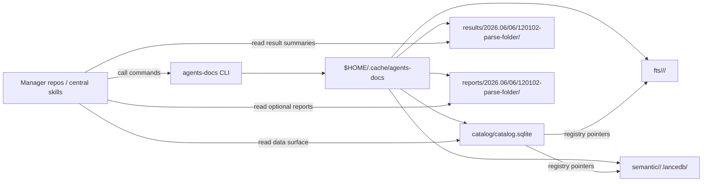
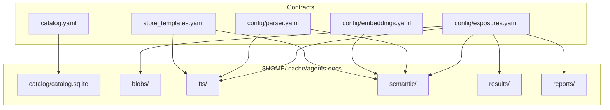

# agents-cli

Reusable local document tooling for agent workflows. The first public surface is
`agents-docs`, a CLI for building and querying a regenerable document corpus
cache.

`agents-docs` owns the implementation for inventory, Docling parsing, SQLite
catalog control, Tantivy FTS indexes, LanceDB semantic stores, refresh behavior,
health checks, and structured command reports. Manager repositories and central
skills call the CLI; they do not implement the lower indexing internals.

Dependency rationale is documented in [docs/dependencies.md](./docs/dependencies.md).
Model/runtime choices are documented in [docs/models.md](./docs/models.md).

## Current Status

This repository is moving from specification into implementation. The package
skeleton, fixed-cache catalog creation/migration, catalog status, health
commands, and folder inventory are implemented. Heavy runtime behavior such as
Docling parsing and index building lands in later phases.

## Install Shape

The package name is `agents-cli`; the console script is `agents-docs`.

Optional dependency groups are defined in [pyproject.toml](./pyproject.toml):

| Extra | Purpose |
| --- | --- |
| `docling` | Docling parsing. |
| `fts` | Tantivy full-text indexes. |
| `semantic` | LanceDB, PyArrow, and NumPy. |
| `embeddings` | FastEmbed local embeddings. |
| `heavy-embeddings` | SentenceTransformers local embeddings. |
| `all` | Practical full local stack. |

## Fixed Cache

The cache root is intentionally not configurable:

```text
$HOME/.cache/agents-docs/
```

The catalog is always:

```text
$HOME/.cache/agents-docs/catalog/catalog.sqlite
```

There is no `init` command. Producer commands call centralized table creation
before writing. `catalog create` creates the fixed catalog when it is missing,
and `catalog migrate` upgrades an existing stale or incomplete catalog.

## Binding CLI Surface

Commands are intentionally shallow: first command plus optional subcommand.
Cache path, profiles, traversal defaults, index defaults, and safeguards come
from config files rather than command arguments.

| First command | Subcommand | Mandatory args | Output | Purpose |
| --- | --- | --- | --- | --- |
| `catalog` | `create` | none | JSON | Create the fixed home catalog if it is missing. |
| `catalog` | `migrate` | none | JSON | Upgrade an existing stale or incomplete fixed home catalog. |
| `catalog` | `status` | none | JSON | Report catalog presence, version, expected tables, missing tables, and row counts. |
| `health` | none | none | JSON | Check fixed paths and available runtime dependencies. |
| `scan` | `folder <path>` | `path` | JSON | Inventory a folder tree and record source items. |
| `parse` | `folder <path>` | `path` | JSON | Auto-scan, parse sources through Docling, and record JSON artifacts/objects. |
| `index` | `folder <path>` | `path` | result files | Build or refresh the FTS island for a folder root. Add `--semantic` for the LanceDB store. |
| `search` | `text <query>` | `query` | result files | Search current Tantivy FTS islands and hydrate chunk provenance. |
| `search` | `semantic <query>` | `query` | result files | Search current LanceDB semantic stores and hydrate chunk provenance. |

Minimal examples:

```powershell
agents-docs catalog create
agents-docs catalog migrate
agents-docs catalog status
agents-docs health
agents-docs scan folder "C:\docs\example-folder"
agents-docs parse folder "C:\docs\example-folder"
agents-docs index folder "C:\docs\example-folder"
agents-docs index folder "C:\docs\example-folder" --semantic
agents-docs search text "contract renewal clause"
agents-docs search semantic "contract renewal clause"
```

`scan folder` accepts optional safeguard overrides only when a caller needs to
exceed configured defaults: `--max-files`, `--max-bytes`, and `--max-depth`.
Add `--report` when an on-demand HTML report is needed. It writes
`source_roots`, `source_items`, current inventory statistics, and a root
`index_scopes` row, then writes `result.json`, `events.jsonl`, and `summary.md`
under `results/`.

`parse folder` auto-runs the required catalog and scan prerequisites. It
defaults to `docling_ocr`; use `--profile docling_fast_text` when a faster
non-OCR run is wanted. The canonical stored artifact is Docling JSON; Markdown
is treated as a lazy/export concern, not a default stored duplicate. OCR parses
use conservative local runtime defaults: two Docling CPU threads, PDF stage
batch size 1, queue size 8, and a 300 second per-document timeout. Use
`--docling-threads`, `--batch-size`, `--queue-size`, `--document-timeout`,
`--max-pages`, or `--max-file-size` for deliberate overrides.

Parse failures are classified in `result.json`, `summary.md`, and optional
HTML reports. Password-protected PDFs, memory exhaustion, timeouts, and
configured size/page safeguards are reported as separate failure kinds with
suggested retry actions. Interactive parse runs show document-level progress on
stderr; use `--no-progress` to suppress it or `--verbose` to keep third-party
parser logs.

`index folder` currently builds the Tantivy FTS island for the folder root from
current parsed document objects. It auto-scans the folder, but it does not
silently parse/OCR missing documents; run `parse folder` first when no parsed
objects exist. Use `--force` to rebuild even when the FTS watermark is current.
Add `--semantic` to build the LanceDB semantic store instead, using the default
FastEmbed profile from `config/embeddings.yaml`.

`search text` searches current Tantivy FTS islands and returns hydrated
provenance fields from stored chunk metadata. Use `--limit` to cap returned
hits.

`search semantic` searches current LanceDB stores and returns the same hydrated
chunk provenance shape, with vector distances converted to sortable scores.

Commands print a short human summary to the terminal instead of the full JSON
payload. The summary includes links to the persisted `result.json`,
`summary.md`, and any generated `report.html`.

## CLI And Data Surfaces

Upper layers interact with this project through two separate surfaces:

- **CLI surface**: commands that create, refresh, index, search, and report.
- **Data surface**: generated SQLite/catalog state, lower index islands, result
  files, and schema/template contracts.



The CLI is the write/control surface. Consumers may read the generated SQLite
catalog directly for data access.

`results/` is generated for every command and is operational proof plus a human
Markdown summary. `reports/` is generated only when requested, for example with
`scan folder --report`; it contains generic HTML analytics reports. Skill
wrappers can customize richer reports by reading `result.json`, `summary.md`,
and the SQLite catalog. Result and report folders are grouped as
`<yyyy>.<mm>/<dd>/<hhmmss>-<command>/`; if the same command starts twice in one
second, a numeric suffix may be added.

## Data Contracts

Review these files for the binding data surface:

| File | Purpose |
| --- | --- |
| [catalog.yaml](./catalog.yaml) | Current-state SQLite catalog schema. |
| [store_templates.yaml](./store_templates.yaml) | Generated Tantivy/LanceDB row templates. |
| [config/exposures.yaml](./config/exposures.yaml) | Fixed cache root, path templates, exposure kinds, blob storage defaults. |
| [config/parser.yaml](./config/parser.yaml) | Parser profiles, traversal defaults, index defaults, safeguards. |
| [config/embeddings.yaml](./config/embeddings.yaml) | Embedding profile config. |
| [docs/models.md](./docs/models.md) | Model/runtime profile plan for Docling, OCR, embeddings, reranking, and local REST providers. |
| [specifications/corpus-cache-cli/spec.md](./specifications/corpus-cache-cli/spec.md) | Durable CLI and data contract. |



## Workflow

Repository workflow rules are in [WORKFLOW.md](./WORKFLOW.md). Current work is
tracked in [plans/2026-06-04-docling-search-index](./plans/2026-06-04-docling-search-index/).
