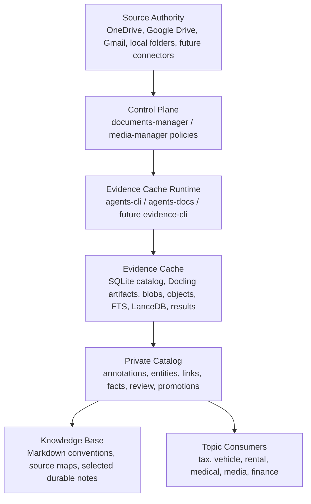
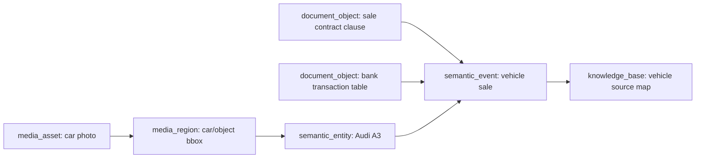
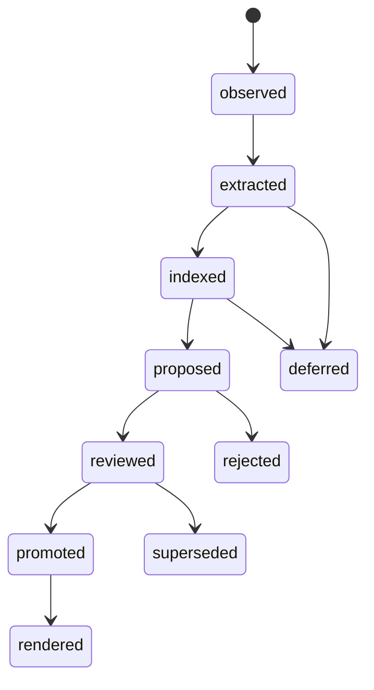

# Handover: Consolidating Documents, Media, and Evidence Indexing

Date: 2026-06-06  
Status: Architecture handover / convergence strategy  
Scope: `agents-cli`, `documents-manager`, `media-manager`, and future topic managers

---

## 1. Executive Summary

The current direction should not be understood as “a document indexer plus a media manager”. The stronger interpretation is that these repositories are converging toward a **local-first evidence memory system**.

The shared product shape is:

```text
raw source authority
  -> rebuildable evidence cache
    -> normalized evidence objects
      -> search projections
        -> private semantic catalog
          -> curated knowledge base
            -> topic-specific consumers
```

The key decision is to consolidate **contracts and layers**, not to collapse all repositories and schemas into one large implementation.

The best outcome is:

```text
public reusable lower engine
  + private control-plane repo
  + media/domain extension
  + topic-specific private consumers
```

In plain terms:

- `agents-cli` should evolve into a reusable lower evidence/cache/index runtime.
- `documents-manager` should become the private control plane for source scope, policy, private catalog, and knowledge promotion.
- `media-manager` should become a media/domain extension that proves the lower engine is not only for documents.
- Future topic managers, such as tax, vehicle, rental, medical, housing, finance, or family archive, should consume curated handoff manifests rather than re-crawling everything.

The real system being built is closer to:

```text
Local-first Evidence Memory
```

or:

```text
Personal Evidence Control Plane
```

than to a normal RAG index.

---

## 2. Repository Roles

### 2.1 `agents-cli`

Current role:

- reusable public lower engine;
- console surface currently named `agents-docs`;
- owns inventory, Docling parsing, SQLite catalog control, Tantivy FTS, LanceDB semantic stores, refresh behavior, health checks, and structured reports;
- writes to a fixed lower cache under `$HOME/.cache/agents-docs/`;
- exposes a CLI surface and a generated data surface.

Recommended future role:

```text
corpus-cache / evidence-cache runtime
```

It should own generic mechanics:

- source roots;
- source items;
- file/connector/archive inventory;
- document parse state;
- Docling artifacts;
- artifact blobs;
- normalized document objects;
- valuable lower-level items;
- generated chunks;
- FTS index islands;
- LanceDB index islands;
- index scope registries;
- result folders;
- health and diagnostics;
- local-only search and optional reranking.

It should **not** own:

- private source choices;
- private retention decisions;
- personal entities;
- family/person/vehicle/trip semantics;
- durable human notes;
- topic-specific reports;
- private knowledge-promotion rules.

Suggested future names, in descending preference:

1. `evidence-cli`
2. `corpus-cache`
3. `evidence-cache`
4. `local-evidence`
5. `docs-cache`

The existing name can remain technically for now, but documentation should stop treating it as agent-specific.

---

### 2.2 `documents-manager`

Current intended role:

- private producer and control plane;
- owns approved source roots, policies, runtime config, private catalog, knowledge base, and handoff manifests;
- calls lower tools rather than implementing Docling, Tantivy, LanceDB, OCR, or embeddings.

Recommended role:

```text
private control plane over a generic evidence cache
```

It should answer:

- Which sources are approved?
- Which paths are included, excluded, deferred, or capped?
- Which generated artifacts are disposable?
- Which private semantic records are durable?
- Which lower rows are trusted evidence?
- Which facts should be promoted to human-readable knowledge?
- Which selected evidence should be handed off to topic consumers?

It should provide:

- source scope manifest;
- layer location manifest;
- policy manifest;
- private catalog schema;
- review queues;
- knowledge-promotion rules;
- topic handoff manifests;
- private knowledge base.

It should not implement lower extraction/indexing internals.

---

### 2.3 `media-manager`

Current role:

- media catalog and semantic memory plan;
- models source items, media assets, metadata, descriptions, entities, aliases, observations, semantic events, face observations, face clusters, duplicate candidates, review tasks, and LanceDB retrieval projections.

Recommended role:

```text
media/domain manager over the same evidence-control architecture
```

It should own media-specific concepts:

- media assets;
- thumbnails;
- EXIF/container metadata;
- image/video descriptions;
- VLM/object/OCR observations;
- GPS/place observations;
- face observations and clusters;
- media review queues;
- media duplicate candidates;
- media-to-entity links;
- media events;
- personal media curation logic.

It should not duplicate generic lower mechanics forever:

- source roots;
- source item freshness;
- hashing;
- result run folders;
- index registry behavior;
- generic FTS/vector projection mechanics.

The near-term compromise can be self-contained bootstrapping, but the long-term direction should align `media-manager` with the same lower source inventory and evidence reference contracts used by documents.

---

### 2.4 Future topic managers

Examples:

- `vehicle-manager`
- `tax-manager`
- `rental-manager`
- `medical-manager`
- `finance-manager`
- `flat-cost-manager`
- `family-archive-manager`

These should not crawl raw source trees by default.

They should consume selected handoff manifests such as:

```yaml
handoff_id: vehicle_2026_001
topic: vehicle
evidence:
  - ref: corpus_cache.documents:doc_123
    role: invoice
    confidence: reviewed
  - ref: media_manager.media_assets:asset_456
    role: visual_evidence
    confidence: proposed
  - ref: private_catalog.semantic_entities:entity_789
    role: vehicle_entity
    confidence: reviewed
```

The topic workspace performs extraction, reasoning, reports, and domain-specific curation only on selected evidence.

---

## 3. Core Architecture

The target architecture is layered by **durability, privacy, and semantic level**.



The lower layer should discover and extract.  
The upper layer should review, decide, promote, and hand off.

---

## 4. Knowledge Layers

### 4.1 Source Authority

Raw source stores remain the authority.

Examples:

- OneDrive;
- Google Drive;
- Gmail;
- local folders;
- future connector objects;
- future media folders;
- archives.

Rules:

- read-only by default;
- no source moves or renames by default;
- source paths and URIs are private data;
- source manifests can be private while schemas stay public;
- stable source IDs should be derived from caller-approved manifests and source metadata.

---

### 4.2 Evidence / Index Cache

This is the large machine-generated layer.

Contents:

- inventories;
- file fingerprints;
- Docling JSON;
- OCR output;
- extracted text;
- document objects;
- detected tables;
- figures;
- diagrams;
- page images;
- thumbnails;
- object crops;
- chunks;
- temporary summaries;
- Tantivy indexes;
- LanceDB stores;
- run reports;
- diagnostics.

Rules:

- sensitive but disposable;
- should be rebuildable from sources, config, hashes, and tool versions;
- should not contain the only copy of a manually curated fact;
- may be deleted when moving to a new PC;
- should record freshness and provenance.

Recommended location:

```text
$HOME/.cache/agents-docs/
```

or, after rename:

```text
$HOME/.cache/evidence-cache/
```

---

### 4.3 Evidence Catalog

This is the generated SQLite control catalog inside the lower cache.

It stores current state, not all historical logs.

Typical tables:

```text
source_roots
source_items
source_root_stats
source_extension_stats
documents
docling_artifacts
artifact_blobs
document_objects
valuable_items
index_scopes
tantivy_indexes
lancedb_stores
```

For media, future lower/common tables could include:

```text
media_assets
media_artifacts
media_regions
media_observations
```

But this should be introduced only if the abstraction is stable. Until then, `media-manager` can own these tables as an upper extension.

---

### 4.4 Search Projections

Search projections are fast query structures, not the source of truth.

Examples:

- Tantivy FTS indexes;
- SQLite FTS if used locally for small cases;
- LanceDB semantic/vector stores;
- optional graph projections;
- optional rerank caches;
- optional high-level summary indexes.

Rules:

- projection rows can duplicate useful metadata;
- projection rows should hydrate back to catalog/evidence refs;
- projection data can be rebuilt;
- projection stores should record model/profile/version/dimensions/watermark;
- no private semantic truth should exist only inside a vector store.

---

### 4.5 Private Catalog

This is the durable private overlay.

It should not copy the lower catalog. It should reference stable lower IDs.

Recommended zones:

```text
annotation
semantic
promotion
```

#### Annotation zone

For:

- labels;
- review states;
- corrections;
- extraction-policy choices;
- quality notes;
- deferral reasons;
- sensitivity notes;
- failure triage.

Mostly regenerable or semi-durable.

#### Semantic zone

For:

- reviewed entities;
- aliases;
- people;
- organizations;
- places;
- vehicles;
- contracts;
- accounts;
- assets;
- events;
- relationships;
- provenance-backed facts.

Durable private state.

#### Promotion zone

For:

- facts ready to become Markdown knowledge;
- facts ready for topic handoff;
- source maps;
- durable naming conventions;
- repeated decisions;
- curated summaries.

Durable or explicitly reviewable.

---

### 4.6 Knowledge Base

Human-readable Markdown.

Use it for:

- stable source maps;
- durable naming conventions;
- taxonomy decisions;
- lessons learned;
- small selected facts;
- handoff instructions;
- private notes worth reading later.

Do not use it as a dump of extracted raw text.

If a fact exists in the private catalog, the knowledge base should explain the convention, story, or decision rather than duplicating every structured row.

---

### 4.7 Topic Workspaces

Topic workspaces consume curated evidence slices.

They should receive handoff manifests rather than performing full indexing.

Examples:

```text
vehicle topic:
  - invoices
  - bank transactions
  - photos of car
  - sale documents
  - maintenance records
  - reviewed vehicle entity

tax topic:
  - invoices
  - statements
  - receipts
  - contract clauses
  - fiscal-year classifications

rental topic:
  - rental contract
  - landlord emails
  - bank transfers
  - utility documents
  - photos
```

---

## 5. The Central Design Rule

Use this rule everywhere:

> Lower schemas describe what was observed and generated. Upper schemas describe what was believed, reviewed, promoted, or used.

Examples:

```text
Lower:
  "This PDF contains a table on page 3."
  "This image has EXIF timestamp X."
  "This OCR text was extracted from region Y."
  "This vector row represents chunk Z."

Upper:
  "This table is a Scalable Capital transaction statement."
  "This person is a reviewed identity."
  "This image depicts the Audi A3."
  "This document belongs to the vehicle-sale event."
  "This fact is promoted into the knowledge base."
```

This avoids schema pollution and keeps the public engine clean.

---

## 6. Universal Evidence Reference Contract

The strongest stitching mechanism is not one shared database. It is a stable cross-layer reference format.

Recommended contract:

```yaml
evidence_ref:
  namespace: corpus_cache
  table: document_objects
  id: obj_123
  kind: table
  source_item_id: src_456
  artifact_id: art_789
  locator:
    page_start: 3
    page_end: 3
    bbox: null
    time_range: null
    byte_range: null
  provenance:
    producer: agents-docs
    producer_version: 0.3.0
    profile: docling_ocr
    source_sha256: "..."
    config_hash: "..."
  confidence:
    value: 0.92
    basis: extraction
```

Simpler string form:

```text
corpus_cache.document_objects:obj_123
media_manager.media_assets:asset_456
private_catalog.semantic_entities:entity_789
```

Every private semantic fact, media entity link, review task, and topic handoff should be able to point back to one or more evidence refs.

This is the convergence layer.

---

## 7. Document Object Model

Documents should follow this split:

```text
source_item
  = file / connector object / archive member

document
  = logical parsed document

document_object
  = page / section / paragraph / table / figure / diagram / image / chart / formula / codeblock / list / caption

valuable_item
  = high-value surfaced object, such as receipt, clause, signature, table, figure, form

chunk
  = generated search/index projection, not durable semantic truth
```

Important rule:

```text
chunks belong to search/index projections.
document_objects belong to the evidence catalog.
semantic facts belong to the private catalog.
```

This prevents the private catalog from becoming a duplicate of lower extraction output.

---

## 8. Media Object Model

Media should follow this split:

```text
source_item
  = file / sidecar / cloud object / archive member

media_asset
  = logical photo / video / live photo / burst / screenshot

media_artifact
  = thumbnail / preview / frame / crop / sidecar / derived image

media_region
  = face crop / object bbox / OCR region / frame timestamp

media_observation
  = generated VLM caption / object label / OCR text / GPS candidate / face embedding

media_entity_link
  = reviewed or proposed link from asset/region/observation to a semantic entity

semantic_event
  = reviewed or proposed event grouping over media and documents
```

Media-specific upper concepts:

```text
person
family group
vehicle
trip
place
city
location
event
face cluster
duplicate set
```

These are not lower-engine concerns.

The lower engine may support media files generically, but reviewed identity and personal context belong in `media-manager` or the private semantic catalog.

---

## 9. How Documents and Media Stitch Together

The common join point is the evidence reference plus entities/events.

Example:

```text
Question:
  "Show all evidence around the Audi sale."

Potential evidence:
  - PDF sale contract
  - bank transaction
  - email confirmation
  - photo of the car
  - image OCR from license plate or document
  - reviewed vehicle entity
  - reviewed sale event
  - knowledge-base note about naming convention
```

Logical graph:



The system can answer with provenance:

```text
I found this because:
  - this parsed PDF object contains the sale clause;
  - this bank statement table contains the matching amount/date;
  - this photo was linked to the reviewed vehicle entity;
  - these items were grouped into the reviewed vehicle-sale event.
```

This is much stronger than classic RAG.

---

## 10. Public / Private Split

### Public

Safe to publish:

```text
schemas
empty catalog definitions
CLI contracts
synthetic fixtures
fake sample documents/media
migration logic
search result schemas
handoff schemas
policy schema templates
repo workflow docs
generic tests
```

### Private

Keep private:

```text
real source manifests
real paths
real SQLite catalog data
generated OCR text
Docling JSON from private docs
media thumbnails
VLM captions
face crops
face embeddings
LanceDB stores
Tantivy indexes
private catalog rows
review decisions
knowledge_base notes
topic handoff manifests
domain reports
```

### Recommended repo pattern

```text
public:
  evidence-cli
  documents-manager-template
  media-manager-template
  topic-manager-template

private:
  my-documents-manager
  my-media-memory
  my-tax-manager
  my-vehicle-manager
```

This does not require immediate repo splitting. But design as if this split exists.

---

## 11. Merge Strategy

Do not merge all repos mechanically.

Merge in this order:

### Step 1: Merge vocabulary

Adopt shared terms:

```text
source authority
evidence cache
evidence catalog
search projection
private catalog
catalog zone
knowledge base
topic workspace
handoff manifest
evidence ref
promotion lifecycle
```

### Step 2: Merge contracts

Define common contracts:

```text
source_root
source_item
artifact
object
observation
index_scope
search_result
evidence_ref
handoff_manifest
review_state
promotion_state
```

### Step 3: Merge lower mechanics

Move generic mechanics into `agents-cli` / future `evidence-cli`:

```text
inventory
fingerprinting
cache paths
artifact blobs
result folders
index registry
Tantivy store templates
LanceDB store templates
search result hydration
diagnostics
health checks
```

### Step 4: Keep semantic overlays separate

Keep these outside lower engine:

```text
person identity
face identity
family relationship
vehicle identity
trip meaning
tax classification
medical meaning
rental dispute interpretation
manual notes
reviewed facts
promoted knowledge
```

### Step 5: Add universal evidence refs

All upper layers should reference lower evidence through stable refs instead of copying rows.

### Step 6: Create handoff manifests

Topic consumers should start from selected evidence, not from full raw source roots.

### Step 7: Promote facts deliberately

Use promotion states:

```text
observed
extracted
indexed
proposed
reviewed
promoted
rendered
superseded
```

---

## 12. Proposed Schema Families

### 12.1 Lower evidence cache schema

Public, reusable, regenerable.

```text
source_roots
source_items
source_root_stats
source_extension_stats
documents
docling_artifacts
artifact_blobs
document_objects
valuable_items
index_scopes
tantivy_indexes
lancedb_stores
```

Possible future modality-neutral additions:

```text
assets
regions
observations
model_runs
```

Do not add these until the media/document overlap is proven.

---

### 12.2 Media extension schema

Public schema possible, private data.

```text
media_assets
media_metadata
media_descriptions
media_artifacts
media_regions
media_observations
geo_observations
face_observations
face_clusters
duplicate_candidates
review_tasks
media_entity_links
semantic_events
event_links
```

---

### 12.3 Private semantic catalog schema

Private data, sanitized schema can be public.

```text
annotations
review_tasks
semantic_entities
entity_aliases
entity_attributes
semantic_relationships
semantic_facts
fact_evidence_links
promotion_candidates
knowledge_exports
handoff_sets
handoff_items
```

---

### 12.4 Topic schema

Private and domain-specific.

Example vehicle topic:

```text
vehicles
vehicle_aliases
vehicle_events
service_records
purchase_records
sale_records
insurance_records
fuel_or_cost_records
vehicle_evidence_links
vehicle_report_sections
```

The topic schema should link back to evidence refs, not duplicate raw extraction.

---

## 13. Search Strategy

Use multiple search surfaces because each layer serves a different question.

### 13.1 Lower full-text search

Good for:

- exact terms;
- contract clauses;
- invoice numbers;
- names;
- account references;
- table text;
- OCR text.

Backend:

```text
Tantivy
```

or SQLite FTS for small/special cases.

---

### 13.2 Lower semantic search

Good for:

- paraphrased questions;
- fuzzy document discovery;
- “find something about...”;
- cross-language approximation;
- captions/descriptions.

Backend:

```text
LanceDB
```

---

### 13.3 Structured SQLite search

Good for:

- filters;
- counts;
- status dashboards;
- stale rows;
- review queues;
- joins;
- policy enforcement;
- provenance inspection.

Backend:

```text
SQLite
```

---

### 13.4 Private semantic search

Good for:

- entities;
- events;
- reviewed relationships;
- topic slices;
- personal naming conventions;
- curated knowledge.

Backend:

```text
SQLite views + optional FTS/vector projection
```

---

### 13.5 Hybrid result shape

All search results should eventually hydrate to:

```yaml
result_id: res_123
match_mode: hybrid
score: 0.87
backend_scores:
  fts: 12.4
  semantic: 0.73
  structured: null
title: "..."
snippet: "..."
evidence_ref: corpus_cache.document_objects:obj_123
source:
  source_item_id: src_456
  source_uri_redacted: true
object:
  type: table
  page_start: 3
  page_end: 3
provenance:
  parser_profile: docling_ocr
  embedding_profile: fastembed_default
review:
  status: unreviewed
links:
  private_entities: []
  topic_handoffs: []
```

---

## 14. Progressive Indexing Policy

Indexing should be progressive and budget-aware.

Default order:

```text
1. inventory metadata
2. classify from path/extension/metadata
3. extract lightweight text where useful
4. parse structure with Docling where valuable
5. OCR only where needed or approved
6. extract tables/figures/diagrams/images
7. generate chunks
8. build FTS index
9. build vector index
10. generate lossy summaries for large folders/archives
11. propose entities/events
12. send uncertain items to review
13. promote durable knowledge
```

Large/risky source areas can use policies:

```text
metadata only
no recursion
max depth
max files
max bytes
archive listing only
capped sample
filename/folder summary
lossy summary
full extraction after approval
media metadata only
```

The key is to preserve deferral state so deeper processing can resume later.

---

## 15. Review and Promotion Lifecycle

Recommended lifecycle:



Meaning:

- `observed`: source item found;
- `extracted`: lower parser/model produced output;
- `indexed`: FTS/vector/structured projection exists;
- `proposed`: model/rule suggested semantic meaning;
- `reviewed`: user or trusted rule accepted it;
- `promoted`: selected for durable knowledge or topic handoff;
- `rendered`: written into Markdown, report, or handoff;
- `deferred`: deliberately not processed further;
- `rejected`: incorrect candidate;
- `superseded`: replaced by a better fact/version.

---

## 16. Anti-Goals

Avoid these traps:

### 16.1 One giant database

Do not put all lower extraction, media semantics, private facts, and topic reports into one monolithic schema.

Use references and manifests.

### 16.2 Private semantics inside the public engine

The reusable engine should not know about:

```text
family member
owned vehicle
private trip
personal bank
medical context
tax category
face identity
```

### 16.3 Vector store as truth

Vectors are retrieval projections. They are not durable truth.

### 16.4 Knowledge base as dump

Markdown knowledge should be curated. It should not become a second copy of all OCR text and extraction output.

### 16.5 Reimplementing lower tools in manager repos

Manager repos should call lower CLIs and read lower catalogs. They should not reimplement Docling, Tantivy, LanceDB, chunking, OCR, or embedding pipelines.

---

## 17. First Vertical Slice

The first useful integration should be narrow.

### Goal

Prove that documents, media, private catalog, and handoff concepts can share evidence refs without collapsing schemas.

### Minimal slice

```text
1. scan one small folder
2. parse a few documents
3. ingest or scan a few media files
4. create lower evidence refs
5. create one private semantic entity
6. link documents/media to that entity
7. build FTS/vector projections
8. run one hybrid search
9. create one handoff manifest
10. promote one note into knowledge_base
```

### Example slice

Topic:

```text
vehicle
```

Evidence:

```text
one vehicle document
one bank statement row/table
one car photo
one reviewed vehicle entity
one event candidate
```

Question to answer:

```text
"Show all evidence related to the Audi sale."
```

Expected result:

- one document result;
- one media result;
- one semantic entity;
- one event grouping;
- one handoff manifest;
- one knowledge-base source map note.

---

## 18. Implementation Checklist

### Lower engine

- [ ] Confirm current `agents-docs` CLI commands are stable enough.
- [ ] Keep fixed cache path documented.
- [ ] Ensure source IDs are deterministic enough for upper refs.
- [ ] Ensure result JSON/JSONL contains run ID, tool version, config hash, and errors.
- [ ] Ensure search results hydrate provenance back to source/object rows.
- [ ] Ensure chunks remain projection rows, not private catalog objects.
- [ ] Add synthetic fixtures for parse/index/search.

### Documents control plane

- [ ] Define private source scope manifest.
- [ ] Define progressive indexing policy.
- [ ] Define private catalog schema.
- [ ] Add evidence ref table or type.
- [ ] Add annotation/semantic/promotion zones.
- [ ] Add handoff manifest schema.
- [ ] Add knowledge-promotion template.
- [ ] Keep real source paths private.

### Media manager

- [ ] Align `source_items` with lower source inventory contract.
- [ ] Keep `media_assets` as logical media objects.
- [ ] Separate observations from reviewed entities.
- [ ] Keep face clusters/private identity out of lower engine.
- [ ] Project useful media descriptions to LanceDB.
- [ ] Hydrate media search results back to media/evidence refs.
- [ ] Add cross-links to private semantic entities/events.

### Topic managers

- [ ] Consume handoff manifests only.
- [ ] Link all derived facts back to evidence refs.
- [ ] Keep domain facts in topic-specific schema.
- [ ] Promote reusable conventions back to knowledge base or private catalog.

---

## 19. Suggested Directory Shape

### Public lower engine

```text
evidence-cli/
  README.md
  catalog.yaml
  store_templates.yaml
  config/
    exposures.yaml
    parser.yaml
    embeddings.yaml
  src/
  tests/
    fixtures/
  specifications/
    corpus-cache-cli/
```

### Private documents control plane

```text
documents-manager/
  README.md
  config/
    document-index.yaml
    source-scope.yaml
    policy.yaml
  catalog.yaml
  knowledge_base/
    source_maps/
    conventions/
    decisions/
  handoffs/
  plans/
  .cache/
    document-index/
      private_catalog.sqlite
```

### Media manager

```text
media-manager/
  README.md
  catalog.yaml
  config/
    media-index.yaml
    review.yaml
  app/
    streamlit_review/
  knowledge_base/
  handoffs/
  .cache/
    media-index/
      media_catalog.sqlite
```

---

## 20. Naming Recommendations

Current names are understandable but can age badly.

Recommended conceptual names:

| Current | Future concept | Comment |
| --- | --- | --- |
| `agents-cli` | `evidence-cli` or `corpus-cache` | It is no longer really agent-specific. |
| `agents-docs` | `evidence` / `corpus` / `docs-cache` | Current CLI can stay during transition. |
| `documents-manager` | `documents-control-plane` | More precise, but maybe too long. |
| `media-manager` | `media-memory` or `media-control-plane` | Stronger if focused on semantic media memory. |
| `private_catalog` | keep | Good name. |
| `knowledge_base` | keep | Clear and durable. |
| `index cache` | `evidence cache` | Better once media enters. |

---

## 21. Decision Summary

Recommended decisions:

1. Treat the whole system as a local-first evidence memory, not a document-only indexer.
2. Keep lower extraction/indexing reusable and public.
3. Keep private source policy and semantic curation in manager repos.
4. Keep media-specific semantics outside the lower engine.
5. Use stable evidence references as the main stitching mechanism.
6. Use manifests as the first integration boundary.
7. Use SQLite for control/catalog layers.
8. Use Tantivy/LanceDB as rebuildable search projections.
9. Use Markdown knowledge base only for curated human-readable decisions.
10. Use topic managers for domain analysis instead of bloating the core.

---

## 22. One-Sentence Architecture

A reusable lower evidence cache extracts and indexes documents/media into provenance-rich SQLite, FTS, and vector surfaces; private manager repos decide what sources are allowed, add reviewed semantic meaning over stable evidence references, promote durable knowledge into Markdown, and hand selected evidence slices to topic-specific workspaces.

---

## 23. Guidance for the Next Agent

When continuing implementation, do not start by adding another parser or another index backend.

Start by preserving boundaries:

1. Identify which layer the requested change belongs to.
2. Ask whether the data is rebuildable or durable.
3. Ask whether the schema is public or private.
4. Ask whether the row is an observation, a projection, a reviewed fact, or a promoted note.
5. Store lower machine output in the evidence cache.
6. Store reviewed personal meaning in the private catalog.
7. Store human-readable conventions in `knowledge_base/`.
8. Link everything through stable evidence refs.
9. Use handoff manifests for topic consumers.
10. Avoid copying lower rows into upper schemas unless a concrete experiment proves it is necessary.

If a design feels confusing, apply the central rule:

```text
Lower schemas describe what was observed and generated.
Upper schemas describe what was believed, reviewed, promoted, or used.
```

That rule is the convergence anchor.

---

## 24. Source Notes

This handover was derived from:

- the public `agents-cli` repository and its current `agents-docs` CLI/cache direction;
- the public `media-manager` schema and semantic-media-memory plan;
- the uploaded `documents-manager` plan, especially its knowledge-layer split, private catalog zones, and control-plane boundary.

The document intentionally avoids private paths or personal facts except generic examples already discussed conceptually, such as vehicle/media/document evidence links.
