# Architecture Review: Trust, Structure, And Retrieval Improvements

Date: 2026-07-10
Status: Review artifact — `review.md` caveats incorporated; not yet a durable
specification

## Purpose

This document explains the high-level architectural impact of the engine
improvement plan. It is intentionally visual and comparative. After review,
accepted rules should move into `specifications/corpus-cache-cli/spec.md`, while
the clearest overview diagrams can be adapted for the repository README.

The five-layer model does not change:

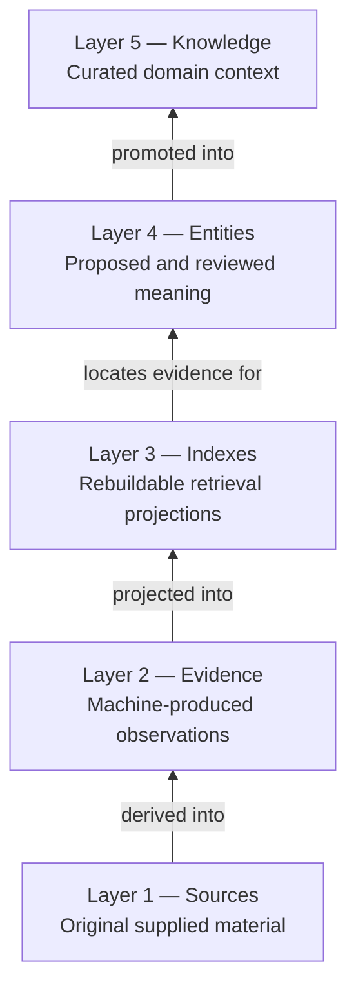

The change is that identity, storage, and query execution will enforce those
boundaries more precisely.

## 1. Current And Target Architecture

### Current

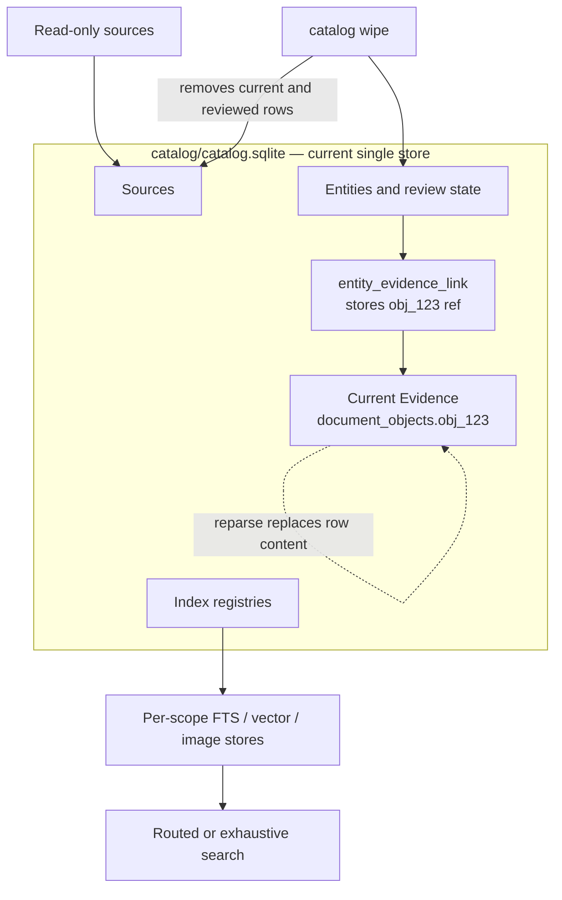

The main trust problem is not that the Layer-4 link row is overwritten. It is
that its stable ref can resolve to changed Layer-2 content after a reparse.

### Target

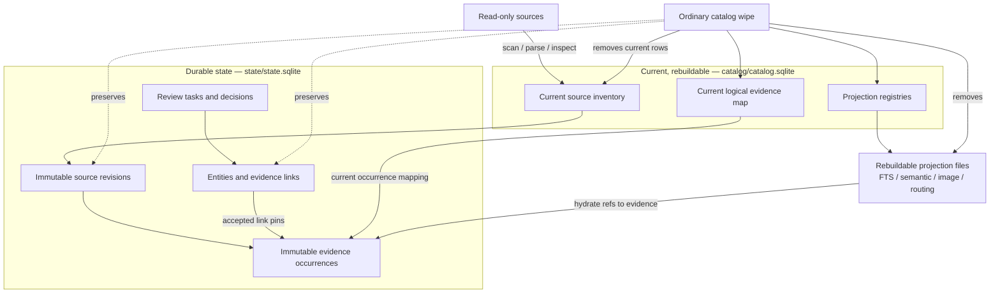

### High-level impact

| Concern | Current behavior | Target behavior | Architectural impact |
| --- | --- | --- | --- |
| Reviewed evidence identity | Link points to a mutable current row | Link pins an immutable occurrence | Reviewed meaning cannot drift silently |
| Physical persistence | One SQLite database contains Layers 1–4 | Current/rebuildable catalog separated from durable state | Cache cleanup no longer deletes reviewed meaning |
| Historical evidence | Full parser artifact exists, normalized row is current only | Reviewed normalized occurrences and provenance remain durable | Exact reviewed content remains explainable |
| Document structure | One synthetic paragraph preview per document | Typed hierarchy of pages, sections, paragraphs, tables, figures, and other objects | Search and review can land on exact evidence |
| Review lifecycle | One current status field per target | Append-only decision plus atomic target/task update | Review becomes auditable and internally consistent |
| Text ranking | Native BM25 scores pooled across independent indexes | Per-index ranks fused by RRF | Cross-scope ranking is comparable |
| Recursive retrieval | Root fanout plus lower-summary diagnostics | L0/L1/L2 decisions restrict proof search | High budget performs real additional retrieval work |
| Image search | Query every compatible image store | Route to bounded proof stores, widen/fallback explicitly | Fanout remains bounded as scope count grows |
| Verification | Implementation tests without quality baselines | Deterministic quality, routing, fanout, latency, and provenance evaluation | Retrieval changes become measurable |

## 2. Semantic Layers Versus Physical Stores

The semantic layer and physical database are related but are not the same
thing. The durable state database contains a narrow Layer-2 occurrence ledger
because accepted Layer-4 meaning depends on those exact observations.

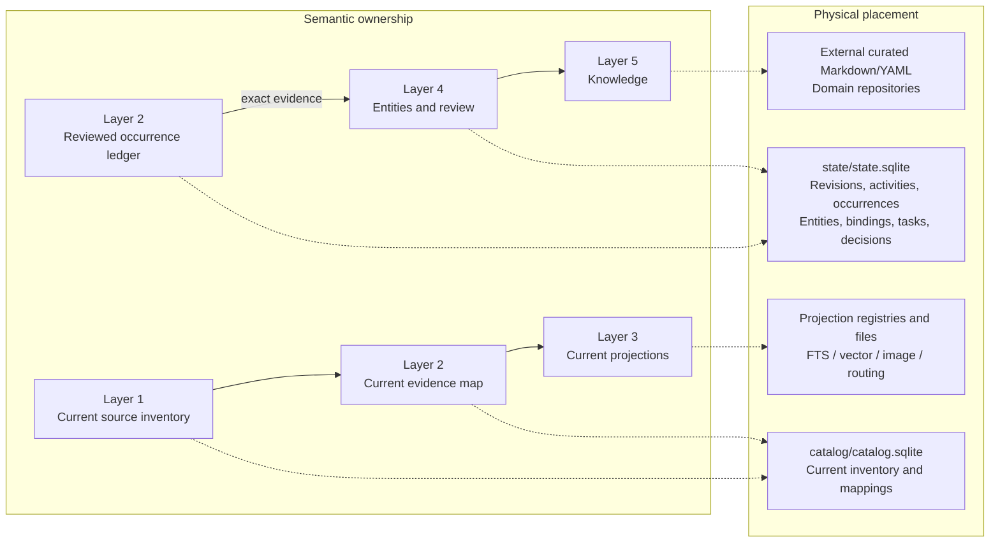

This does not promote machine evidence into Layer 4. It makes the exact
Layer-2 input to a durable human decision durable as well.

All occurrences enter durable state, including unreviewed ones. An occurrence
is collectible only when no Layer-4 row references it and no current logical
object maps to it. Status exposes retained/collectible/orphan-source rows and
bytes from the start; deletion requires a later reviewed GC design.

### Store ownership table

| Data | Semantic layer | Store | Mutable? | Ordinary wipe? |
| --- | --- | --- | --- | --- |
| Current source inventory | 1 | `catalog.sqlite` | Yes | Removed |
| Immutable source revision metadata | 1/lineage | `state.sqlite` | No | Preserved |
| Current document/media object mapping | 2 | `catalog.sqlite` | Yes | Removed |
| All immutable normalized occurrences | 2 | `state.sqlite` | No; retained until collectible | Preserved |
| FTS chunks, embeddings, summaries, medoids | 3 | projection files + registries | Rebuildable | Removed |
| Entities, aliases, classifications, attributes, relationships | 4 | `state.sqlite` | Lifecycle-managed | Preserved |
| Evidence links, review tasks, decisions | 4 | `state.sqlite` | Decisions append-only | Preserved |
| Domain knowledge and ontologies | 5 | Outside the engine | Curated externally | Outside scope |

## 3. Identity Model

### Why two evidence identities are necessary

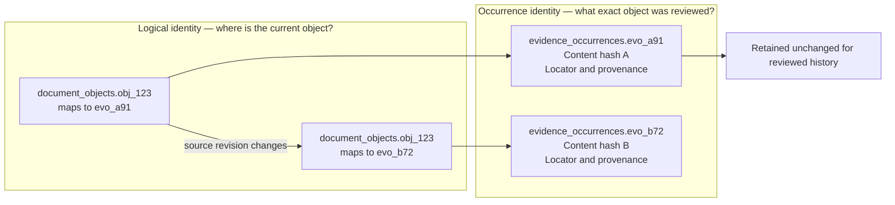

The logical ID is useful for navigation and current-state workflows. The
occurrence ID is required for review, audit, and reproducibility.

### Reference shape

| Field | Example | Meaning | Intended consumers |
| --- | --- | --- | --- |
| `ref` | `corpus_state.evidence_occurrences.evo_a91` | Exact immutable evidence in durable state | Layer-4 binding, audit, provenance, search result |
| `logical_ref` | `corpus_cache.document_objects.obj_123` | Current logical location | UI navigation, current-state comparison, reprocessing |
| Projection ID | `chunk_...`, vector row, medoid ID | Rebuildable search artifact | Layer-3 internals only; never a Layer-4 evidence ref |

### Source change and review sequence

```mermaid
sequenceDiagram
    participant S as Source
    participant C as Current catalog
    participant D as Durable occurrences
    participant E as Entity runtime

    S->>C: Parse source revision A
    C->>D: Create occurrence evo_A with hash A
    C->>C: Map obj_123 to evo_A
    E->>D: Resolve obj_123 to evo_A
    E->>E: Accept link and store evo_A
    S->>C: Source changes; parse revision B
    C->>D: Create occurrence evo_B with hash B
    C->>C: Remap obj_123 to evo_B
    E->>D: link.ref resolves reviewed evo_A
    E->>C: link.logical_ref resolves current obj_123 to evo_B
    Note over D,E: Acceptance remains on evo_A; it is not transferred to evo_B
```

### Pin-at-write behavior

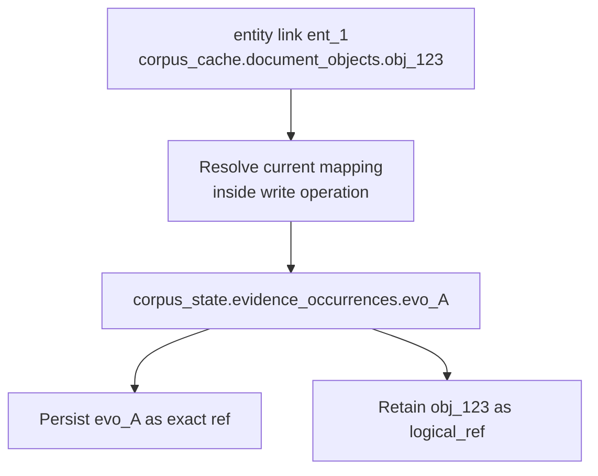

An accepted link never stores a follow-current policy. A caller can explicitly
resolve the logical ref later, but that is a separate read.

## 4. Evidence Production And Projection Flow

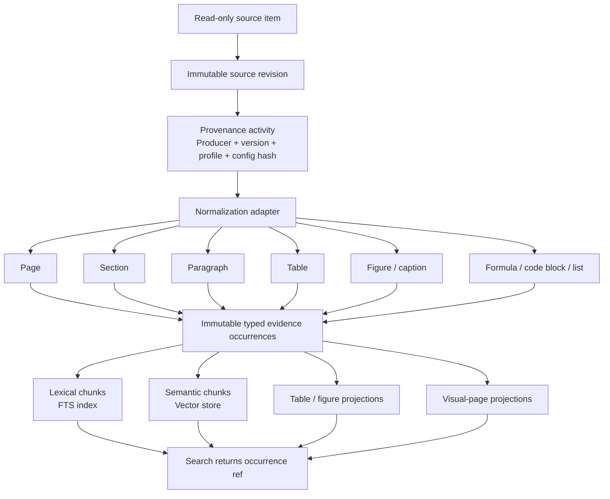

Evidence objects and chunks are deliberately separate:

| Evidence object | Chunk projection |
| --- | --- |
| Semantically meaningful observation | Retrieval implementation detail |
| Typed and locatable | Profile- and model-dependent |
| May be pinned by Layer 4 | Never pinned by Layer 4 |
| Stable immutable occurrence | Freely rebuilt or rechunked |
| Preserves provenance and content hash | Carries the occurrence ref back to evidence |

## 5. Review Transaction

### Current behavior


### Target behavior

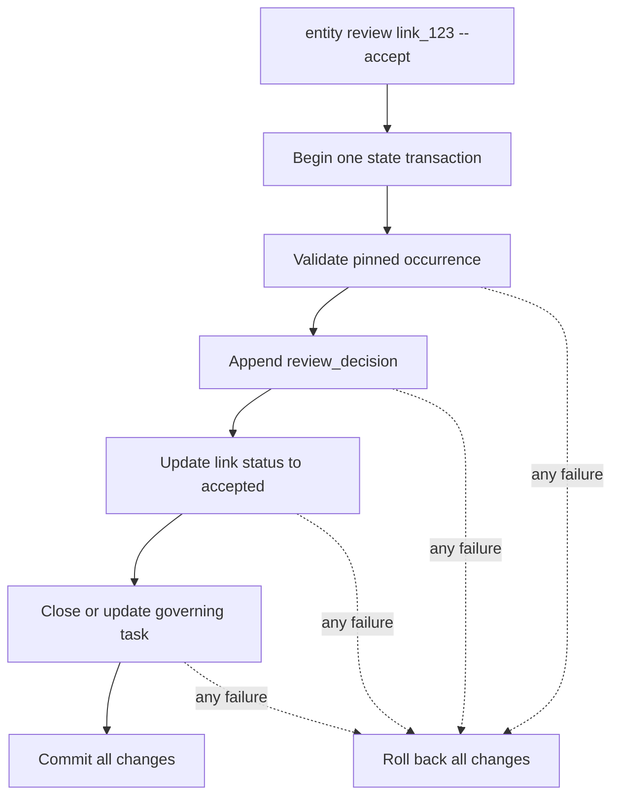

| Record | Role | History behavior |
| --- | --- | --- |
| Evidence link/classification/attribute/relationship | Current lifecycle state | Updated only through runtime |
| Review task | Work queue state and explicit target | Synchronized with target decision |
| Review decision | Reviewer action, rationale, previous/new state | Append-only |
| Evidence occurrence | Exact reviewed observation | Immutable |

## 6. Retrieval Architecture

### Text retrieval before and after

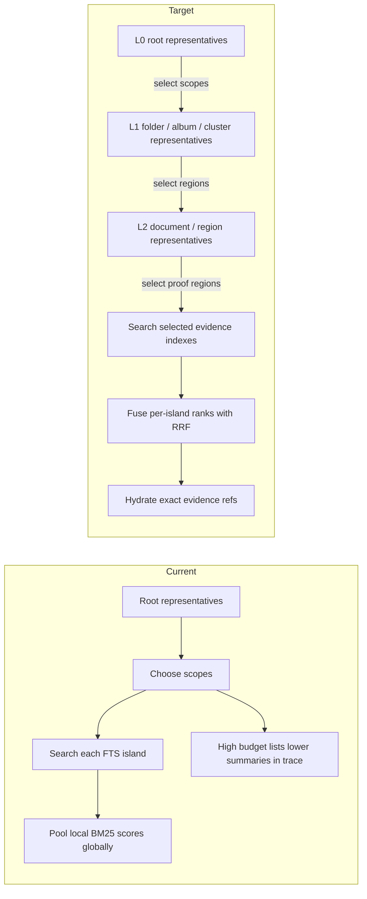

### Budget semantics

| Budget | Route | Expected trade-off |
| --- | --- | --- |
| Low | L0 -> best scope -> evidence | Lowest fanout/latency, highest routing risk |
| Mid | L0 -> top scopes -> optional L1 -> evidence | Default balance |
| High | L0 -> L1 -> L2 -> evidence, controlled widening | More decisions and proof searches for higher recall |
| Exhaustive | All compatible proof stores | Quality baseline and explicit fallback |

### Cross-island ranking

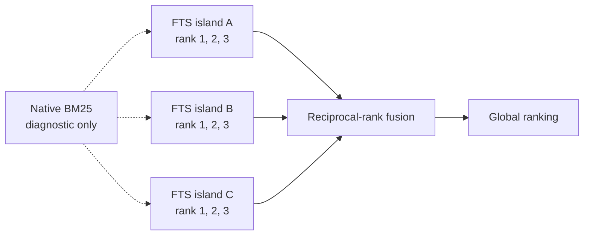

### Image retrieval

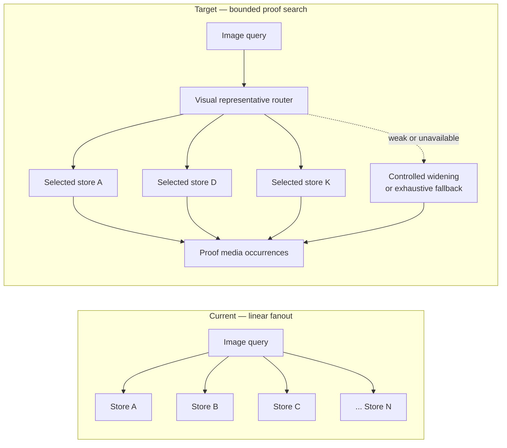

Medoids and embeddings locate evidence; they are not evidence.

## 7. Migration And Operational Impact

### Migration path

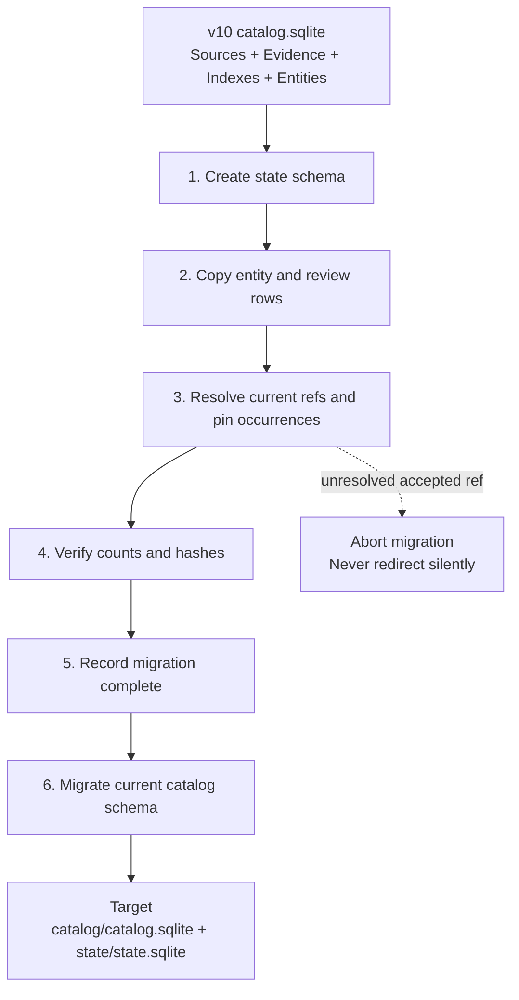

An unresolved accepted ref stops migration. It is never silently discarded or
redirected to whatever current evidence happens to exist.

### Command impact

| Operation | Target behavior |
| --- | --- |
| `catalog create` | Creates/validates both current and state stores |
| `catalog status` | Reports both schema versions, migrations, integrity, and retained/current/referenced/collectible/orphan-source counts and bytes |
| `catalog wipe` | Removes current catalog/projections only; state survives |
| `catalog wipe --include-state --force` | Explicit destructive reset with durable-row warning/counts |
| `catalog backup-state <output.sqlite>` | Consistent SQLite backup of durable state only |
| `catalog restore-state <backup.sqlite> --force` | Validated restore with recovery copy and post-restore cross-store integrity diagnostics |
| Parse/inspect | Insert/deduplicate revision and occurrence, then update current map |
| Search | Return exact `ref` plus current `logical_ref` |
| Entity link | Pin logical input to exact occurrence before persisting |
| Entity review | Append decision and update target/task atomically |

Both SQLite files use WAL, but no correctness rule assumes a transaction can
commit atomically across them. Producers commit durable state first and update
the current mapping idempotently afterward. A failed second step is diagnosed
and safely retried.

### Component impact matrix

| Component | Change level | Main responsibility after change |
| --- | --- | --- |
| `catalog.yaml` / schema loader | High | Describe two stores and enforce stronger invariants |
| `paths.py`, `db.py`, `catalog.py` | High | Store-specific paths, connections, versions, migrations, wipe/backup |
| `parse.py` and normalization adapter | High | Typed objects, revisions, activities, immutable occurrences |
| `media.py` | Medium–High | Media revisions/occurrences and current mappings |
| `references.py` | High | Exact/current ref generation and hydration |
| `entities.py` | High | Pin-at-write links and transactional decision history |
| `chunks.py`, `fts.py`, `semantic.py` | Medium–High | Occurrence-based chunks and rank fusion |
| `routing/` | High | Executed hierarchy and bounded widening |
| `image_index.py` | Medium–High | Routed proof-store search and diagnostics |
| `src/web` | Medium | Read both stores; display exact versus current evidence |
| Tests/evaluation | High | Trust regression, migrations, ranking, routing, and quality gates |

## 8. Architectural Invariants After Implementation

1. Sources are read-only.
2. Current logical evidence may change; reviewed occurrence evidence may not.
3. Layer 4 pins exact evidence, never chunks, embeddings, vectors, or medoids.
4. Ordinary cache cleanup cannot delete reviewed meaning or its pinned evidence.
5. Human decisions live in durable state; machine confidence remains evidence.
6. Review history is append-only and target/task state changes atomically.
7. Search can narrow proof work, but every result hydrates to evidence.
8. Routing and retrieval quality are measured separately.
9. Weak routing widens or falls back explicitly; it does not hide recall loss.
10. Knowledge and domain semantics remain above the engine.

## 9. What Does Not Change

| Stable boundary | Remains true |
| --- | --- |
| Source ownership | The engine never modifies or duplicates source files |
| Layer model | Sources, Evidence, Indexes, Entities, Knowledge remain distinct |
| CLI ownership | Reusable engine behavior stays in `even`; manager repositories are consumers |
| Output style | CLI remains JSON-first with human-readable renderings derived from it |
| Domain ownership | Private/domain knowledge and ontologies remain outside the generic engine |
| Retrieval proof | Search results must resolve back to evidence; routing representations are lossy maps |
| UI write path | Entity/review writes continue through the Python runtime, never direct web SQL |

## 10. Review Checklist

Before promoting this architecture into the spec and README, confirm:

- the two-store boundary and the inclusion of the immutable occurrence ledger
  in durable state are accepted;
- retention of every occurrence until the fixed collectibility predicate is
  satisfied is accepted, with deletion deferred to a separate GC design;
- WAL plus durable-first/retryable-current writes are accepted, with no
  cross-file atomicity assumption;
- original historical source bytes are explicitly not retained by the engine;
- pin-at-write is preferred over any follow-current Layer-4 binding;
- the v10 migration abort/quarantine rules are acceptable;
- migration-time pins are understood to establish trust going forward and are
  marked as unverified history rather than treated as review-time proof;
- orphaned preview-grained logical refs remain pinned and trigger re-review;
- pure image search should move from exhaustive federation to routed proof with
  explicit fallback;
- the budget ladder and RRF baseline/calibration policy are acceptable public
  behavior;
- state wipe and backup command names are suitable;
- the web viewer should display reviewed occurrence and current logical state
  side by side when they differ.

Once accepted, remove planning language while promoting durable rules; keep
implementation sequencing and migration history in this packet rather than in
the specification.
