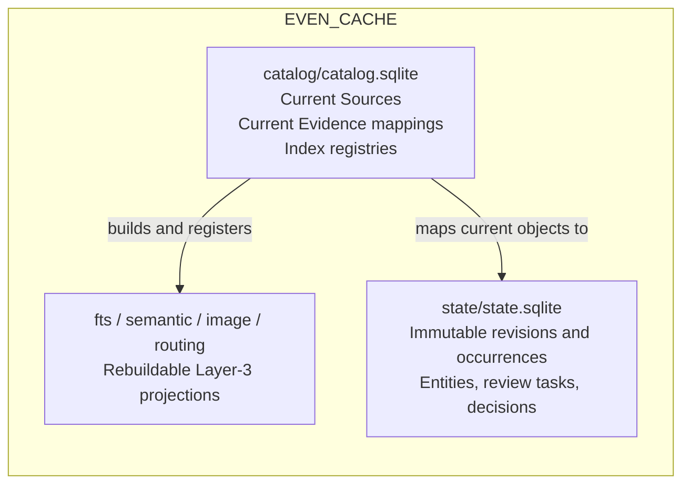
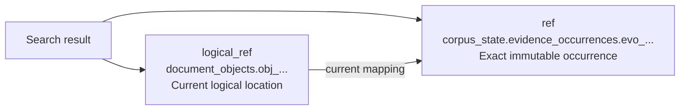

# Plan: Evidence Engine Trust, Structure, And Retrieval Improvements

Date: 2026-07-10
Status: Ready for implementation — `review.md` caveats incorporated 2026-07-10
Source: `handoff.md` in this packet

## Review Disposition

The read-only review in [review.md](review.md) approved the direction with
caveats. This revision accepts all requested pre-Milestone-0 changes and folds
the moderate/minor findings into the implementation and test contracts. Most
importantly, it makes retention and migration trust explicit, assumes no
cross-file transaction atomicity, defines deterministic occurrence IDs, and
adds orphan/ref integrity states before immutable rows exist.

| Review item | Disposition |
| --- | --- |
| RV-001 — durable-state growth | Accepted: remove “small”; fix collectibility now; report rows/bytes; defer deletion to a separate GC design. |
| RV-002 — cross-file atomicity | Accepted: pin WAL per store but assume no cross-file atomic commit; durable-first plus retryable current mapping. |
| RV-003 — migration trust | Accepted: migration establishes a forward baseline; mark every migration pin and flag known hash mismatch for re-review. |
| RV-004 — preview-to-typed transition | Accepted: explicit orphan state; preserve pinned history and open re-pin/re-review work. |
| RV-005 — occurrence identity | Accepted: exact canonical ID tuple/encoding; exclude activity instance; first writer wins with append-only output edges. |
| RV-006 — RRF calibration | Accepted: RRF is the baseline, with benchmark-justified island prior/native sanity floor allowed. |
| RV-007 — multi-scope routing | Accepted: required evaluation fixture and widening proof. |
| RV-008 — `valuable_items` migration | Accepted: non-`unreviewed` v10 values are presumed human decisions by `unknown-pre-migration`. |
| RV-009 — operational details | Accepted: dataset-prefixed refs, orphan-source diagnostics, Windows lock errors, partial-migration viewer behavior, restore proof, and reviewer defaults. |

## Problem Summary

The repository's five-layer model is sound, but several runtime and persistence
details do not yet enforce it:

- Layer-4 links store refs to mutable current Layer-2 rows. In particular,
  `document_objects.object_id` is stable across parses while the row is deleted
  and recreated from the latest source content. The existing durability proof
  shows that entity rows survive a same-source rebuild; it does not prove that
  an accepted link keeps resolving to the exact content that was reviewed after
  the source changes.
- The rebuildable catalog and durable entity/review rows share
  `catalog/catalog.sqlite`; `catalog wipe` deletes all of them.
- document parsing stores the full Docling JSON artifact but materializes only
  one synthetic paragraph preview per document.
- review commands update one current status field. They do not append a review
  decision or atomically synchronize a link and its review task.
- high-budget routing widens root fanout and reports lower summaries, but does
  not use those summaries to make another retrieval decision.
- FTS hits from independent indexes are globally sorted by their native BM25
  scores even though those scores use different local corpus statistics.
- pure image search fans out over every current per-scope image store.
- schema enums and lifecycle rules are mostly documentation/application
  conventions, and stale schemas still require wipe/recreate.
- there is no deterministic evaluation harness proving retrieval quality,
  routing quality, fanout, cost, or latency trade-offs.

The plan preserves the existing layer model and public JSON-first CLI style. It
repairs the trust boundary first, then exposes typed evidence, then changes
retrieval, and measures each retrieval change against an exhaustive baseline.

## Resolution Summary

Implement three related boundaries:

The durable database contains an immutable evidence ledger as well as Layer 4.
This is intentional: exact reviewed evidence cannot remain resolvable after a
source changes if the only copy of the normalized occurrence is in a wipeable
cache. The ledger remains Layer-2 data semantically; its physical durability is
required by accepted Layer-4 bindings. Current mappings and Layer-3 projections
remain rebuildable, but ledger occurrences are retained until they satisfy the
collectibility rule below. State size therefore grows with source/parser churn,
not only with reviewed meaning, and must be visible in status/backup reporting.

The high-level architectural impact, identity flows, storage ownership, and
migration boundary are illustrated in [architecture.md](architecture.md). That
document is the review artifact to promote into the durable specification and
README diagrams after the direction is accepted.

Search and hydration expose both identities:

Layer-4 evidence bindings always store the exact occurrence ref. If a caller
passes a current logical ref to `entity link`, the runtime resolves and pins its
current occurrence in the same operation and returns both the input and pinned
refs. Following current state remains an explicit read operation; an accepted
binding never follows current state implicitly.

## Goals And Objectives

1. Make accepted meaning stable across source changes, reparsing, reindexing,
   routing rebuilds, parser upgrades, and ordinary cache cleanup.
2. Protect durable state physically and migrate existing catalog-v10 entity
   rows without data loss.
3. Materialize Docling's typed hierarchy and exact locators as normalized
   evidence, independently from search chunking.
4. Make review actions transactional and historically auditable.
5. Normalize cross-index ranking, implement real hierarchical deepening, and
   bound global image-search fanout.
6. Establish deterministic retrieval, routing, provenance, and scale baselines
   that can reject regressions in CI.
7. Keep specifications, `catalog.yaml`, CLI behavior, the web viewer, and
   runtime implementation synchronized as contracts change.

## Scope

In scope:

- durable current-versus-occurrence identity and reference contracts;
- source revision, provenance activity, evidence occurrence, current-object
  mapping, review decision, and review-task-target schemas;
- versioned, idempotent migration from the current v10 single database;
- protected wipe/reset behavior and independent state backupability;
- normalized Docling pages, sections, paragraphs, tables, figures, diagrams,
  images, charts, formulas, code blocks, lists, and captions when present;
- exact page spans, bounding boxes, reading order, hierarchy, content hashes,
  parser/profile/config identity, and redaction-safe diagnostics;
- evidence-aware lexical and semantic chunk projections;
- immutable document and media occurrences for every evidence type accepted by
  Layer 4;
- append-only review decisions and atomic link/task lifecycle changes;
- removing human review state from rebuildable `valuable_items`;
- RRF across independent FTS islands;
- actual L0 -> L1 -> L2 -> evidence recursive routing;
- visual representative routing with bounded local image-store proof search;
- evaluation fixtures, judgments, runners, metrics, reports, and CI gates;
- schema constraints, migrations, documentation, and viewer compatibility.

Non-goals:

- changing the five-layer ownership model or making the engine own domain
  ontologies/Knowledge;
- copying, moving, renaming, or modifying source files;
- retaining original historical source bytes; the durable ledger retains the
  normalized occurrence, locator, hashes, and provenance needed to explain the
  review, while the original supplied source remains read-only and externally
  owned;
- model-driven entity extraction, graph extraction, entity merge/dedupe, or
  domain-specific promotion workflows;
- adopting a full W3C PROV implementation;
- adding a remote service, multi-user authorization, or distributed storage;
- redesigning the web UI beyond adapting it to the split stores and new refs;
- guaranteeing typed objects that Docling did not produce or inferring fake
  locators when parser evidence is absent.

## Locked Decisions And Open Points

All points required to begin implementation are resolved. New discoveries may
change a decision only if this plan, the durable spec, and the implementation
log are updated together.

| ID | Status | Resolution |
| --- | --- | --- |
| OP-001 | Resolved | Retain `catalog/catalog.sqlite` as the compatible path for current/rebuildable data; add `state/state.sqlite` for the immutable evidence ledger and Layer 4. |
| OP-002 | Resolved | `evidence_occurrences` is generic across document and media evidence. Current tables carry an `occurrence_id`; search returns exact `ref` plus `logical_ref`. |
| OP-003 | Resolved | Layer-4 links always pin occurrences. Passing a logical ref is allowed only as pin-at-write input; no accepted link silently follows current state. |
| OP-004 | Resolved | `catalog wipe` removes/recreates only rebuildable catalog and projection state. Destruction of `state/state.sqlite` requires a separately named `--include-state --force` operation with accepted-row counts in the warning/result. |
| OP-005 | Resolved | Support an idempotent v10 migration. Copy and verify durable rows into state before removing them from the current catalog. Arbitrary older beta catalogs remain unsupported. |
| OP-006 | Resolved | Normalized evidence stores full normalized object text plus typed locator/attributes; `text_preview` remains diagnostic only. Chunk boundaries remain Layer 3. |
| OP-007 | Resolved | Human review state is removed from `valuable_items`; machine confidence/status remains in Layer 2 and human decisions live in state. |
| OP-008 | Resolved | Cross-island lexical results start with per-island ranks and RRF; native BM25 is never globally pooled. The contract permits a benchmark-justified island prior or per-island native-score sanity floor so tiny/noisy islands are not automatically equalized. |
| OP-009 | Resolved | High-budget routing must execute L1/L2 selection and restrict proof search; extra trace data alone does not count as recursive retrieval. |
| OP-010 | Resolved | Pure image search uses representative routing to a bounded number of proof stores, with deterministic widening/exhaustive fallback. Medoids remain routing artifacts, never evidence. |
| OP-011 | Resolved | Evaluation baselines are captured before ranking/routing behavior changes and rerun after each relevant milestone. |
| OP-012 | Resolved | `src/web` uses short-lived read-only connections to both stores for entity counts/pages and degrades when state is absent or migrating; all writes still go through the Python entity runtime. |
| OP-013 | Resolved | Both SQLite stores use WAL for reader/writer concurrency, but correctness assumes no atomic commit across files. Dual-store work is durable-state-first plus an idempotent/retryable current mapping. Attached transactions are never a correctness dependency. |
| OP-014 | Resolved | An occurrence is collectible only when no Layer-4 row references it and no current logical object maps to it. This packet exposes counts/candidates; actual deletion remains deferred until a separately reviewed GC design. |
| OP-015 | Resolved | Migration establishes the trust baseline going forward; v10 cannot prove what content was visible at review time. Every migrated pin is audit-marked and hash mismatch/unknown history is surfaced for re-review. |
| OP-016 | Resolved | Exact refs use the dataset prefix `corpus_state`; current/legacy refs use `corpus_cache`. The first ref segment selects the physical dataset/store. |

## Target Data Contract

Exact column spelling may be adjusted only during the specification-first
milestone; the following semantics are fixed.

### Durable state tables

- `source_revisions`: immutable `revision_id`, logical `source_item_id`, source
  SHA-256, observed size/mtime, first-observed timestamp, and source locator.
  Unique on logical source plus content hash.
- `provenance_activities`: `activity_id`, kind (`parse`, `inspect`, `describe`,
  `index`, `summarize`), producer/version, profile, config hash, start/end,
  status, and error classification. Activity completion is the only permitted
  lifecycle update; generated occurrence rows are never rewritten.
- `evidence_occurrences`: immutable `occurrence_id`, source revision,
  `first_activity_id`, logical evidence kind/id, producer object key, object
  type, full normalized text where applicable, content hash, locator JSON,
  attributes, and creation time. The ID is derived from exactly: source
  revision ID, producer, producer version, profile, config hash, producer
  object key, object type, and content hash. It excludes the activity instance
  ID and timestamps. Canonical encoding is a UTF-8 JSON array in that field
  order, with compact separators and no ASCII escaping; the public ID is
  `evo_` plus the complete lowercase SHA-256 hex digest of those bytes. Null
  and empty string remain distinct JSON values. Identical output therefore
  deduplicates across runs.
- `activity_occurrences`: append-only activity-to-occurrence output edges. On
  dedupe, the occurrence keeps its original `first_activity_id` (first writer
  wins) while the later activity records its output edge; immutable occurrence
  provenance is never rewritten.
- the existing seven entity tables, migrated from the v10 catalog;
- `review_decisions`: append-only decision ID, target kind/ID, previous and new
  state, reviewer, rationale, producer, and timestamp;
- `review_tasks` gains explicit `target_kind` and `target_id`. A task points to
  the Layer-4 row it governs; `evidence_ref` remains supporting context.

Retention is explicit: every inserted occurrence is retained, reviewed or not,
until it is both unreferenced by all Layer-4 rows and not the current mapping of
any logical object. `catalog status` reports total, referenced, current,
collectible, and orphan-source occurrence counts plus bytes. No automatic or
manual deletion ships until a later GC design proves dependency traversal,
backup, dry-run, and rollback behavior.

### Current catalog mappings

- current source/document/media tables retain their logical IDs and current
  status;
- `document_objects` and `media_assets` gain required `occurrence_id` mappings;
- document hierarchy stays in current logical IDs (`parent_object_id`) while
  the occurrence stores the exact historical locator and content;
- `valuable_items` represents machine candidates only: extraction/classifier
  status and confidence, no `accepted|rejected|deferred` human status;
- projection registries record the activity/config and occurrence high-watermark
  from which they were built.

### Database invariants

- primary IDs and required lifecycle fields are `NOT NULL`;
- enum values use `CHECK` constraints;
- confidence values are null or in `[0, 1]`;
- mutually exclusive relationship targets are enforced;
- source revision and occurrence rows reject update/delete through triggers;
- accepted Layer-4 evidence links require an occurrence ref that resolves;
- review decisions are insert-only;
- one current mapping exists per logical object ID;
- state-internal foreign keys are enabled on every connection;
- cross-database refs are validated by the runtime and by integrity checks,
  since SQLite cannot enforce foreign keys across database files.

### Journal And Cross-Store Write Contract

- both `catalog.sqlite` and `state.sqlite` explicitly use and verify
  `journal_mode=WAL`; a future mode change requires a spec/migration change;
- no operation relies on SQLite atomicity across attached database files;
- dual-store producers commit the durable revision/activity/occurrence first,
  then idempotently update the current logical mapping;
- failure after the durable commit leaves a diagnosable incomplete current
  mapping that the same operation can safely retry;
- review/link/task/decision writes are state-only and remain one ordinary
  single-database transaction;
- `ATTACH` may be used for reads or performance, never as the sole consistency
  mechanism.

## Reference And Compatibility Contract

- `resolve_ref` supports exact occurrence refs and current logical refs and
  identifies the result as `exact` or `current`.
- the ref grammar is `<dataset>.<table>.<row_id>`: `corpus_state` routes to
  `state.sqlite`, while `corpus_cache` routes to `catalog.sqlite`.
- existing `document_objects`/`media_assets` refs remain readable and are
  treated as current logical refs.
- new search/index output uses exact occurrence `ref` by default and includes
  `logical_ref` for navigation/backward-compatible workflows.
- migrating an existing entity link resolves its v10 logical ref at migration
  time, creates/deduplicates the corresponding occurrence, stores the pinned
  ref, and retains the old logical ref. Because v10 did not preserve the
  review-time occurrence, this pin represents current-at-migration evidence,
  not proof of what the reviewer originally saw. Every such link carries
  `pinned_at_migration: true`, `pin_trust: unverified_migration`, migration
  timestamp, current source hash, and any recoverable review-time hash. A
  recoverable hash mismatch sets `requires_re_review: true` and opens a
  migration-revalidation task. Missing historical hashes remain explicitly
  unknown. An unresolvable accepted link aborts migration; an unresolvable
  proposed or rejected link is reported and quarantined, never silently
  rewritten.
- `entity show` hydrates the pinned occurrence first and may also show the
  current logical row separately. It reports `logical_ref_status` as `current`,
  `orphaned`, or `missing`; for orphaned refs it returns the pinned evidence,
  `current_evidence: null`, and the integrity reason. It never substitutes
  current content for a missing pinned occurrence. Accepted links orphaned by
  typed normalization are flagged `requires_re_review` and receive an explicit
  re-pin/re-review task without changing the historical pinned occurrence.
- image embeddings, text embeddings, FTS chunks, summaries, and medoids are
  Layer-3 projections and are never valid Layer-4 evidence refs.

## Implementation Milestones

### Milestone 0 - Contract, baseline, and failing trust proof

1. Update `specifications/corpus-cache-cli/spec.md` before runtime code with
   the storage, identity, reference, review, migration, recursive-routing,
   image-routing, projection/evidence, retention/collectibility, journal-mode,
   dual-store write, migration-trust, occurrence-ID, and orphan-ref rules above.
2. Split `catalog.yaml` into two named datasets: `corpus_cache` for
   `catalog/catalog.sqlite` and `corpus_state` for `state/state.sqlite`.
   Extend the schema loader to select a dataset explicitly; do not infer a
   table's store from its name or maintain duplicate definitions.
3. Add a regression test that currently fails: parse source revision A, bind
   and accept an object, change the source to revision B, reparse, and assert
   that the accepted link still resolves A's content/hash/locator.
4. Add a wipe-protection regression: ordinary wipe preserves durable state and
   accepted occurrence hydration.
5. Create the deterministic evaluation fixture/query/judgment format and
   capture pre-change exhaustive, routed, FTS, hybrid, and image baselines.
   Include deliberately multi-scope queries whose relevant evidence cannot be
   answered from the single best scope.

Gate: the durable contract is internally consistent, the semantic-drift test
fails for the verified reason, and baseline reports are committed before
behavior changes.

### Milestone 1 - Store split and versioned migration

1. Generalize `paths.py`, `db.py`, and `catalog.py` into explicit current and
   state paths/connections while keeping `catalog_path()` as the compatible
   current-catalog helper.
2. Add independent current/state schema versions and ordered, idempotent
   migrations. Each migration runs in a transaction and records its ID,
   checksum, start/end, and result.
3. Set and verify WAL independently on each store. Design migration and all
   dual-store writes as durable-first/idempotent-current workflows; do not rely
   on cross-file commit atomicity.
4. Implement v10 adoption in this order: create state schema; attach/read v10;
   copy entity/review rows; pin current-at-migration occurrences with the
   mandatory audit/trust markers; create re-review flags/tasks for recoverable
   hash mismatches; validate row counts and content hashes; record the
   migration; then migrate the current catalog schema. A restart at any point
   must safely resume. Migration output states that pre-migration semantic
   drift is undetectable and trust guarantees begin at migration.
5. Change `catalog create/status/wipe` output to report both stores. Ordinary
   wipe cannot touch state; destructive state reset requires
   `--include-state --force` and reports the durable row counts affected. On
   Windows lock failure, return the exact store/path and a holder category
   (`viewer`, `engine`, or `external/unknown`) when determinable.
6. Add `even catalog backup-state <output.sqlite>`, implemented with SQLite's
   backup API against a consistent read transaction. It must refuse to
   overwrite an existing output unless `--force` is supplied and must not
   include current catalog, FTS, vector, image, or routing files.
7. Add and document `even catalog restore-state <backup.sqlite> --force`:
   validate the backup schema/integrity first; require writer/viewer handles to
   be closed; retain the replaced state file as a timestamped recovery copy;
   restore through SQLite's backup API; then run cross-store integrity checks.
   Restoring state against a mismatched current catalog is allowed and safe;
   unresolved/orphaned current refs are reported, never rewritten.
8. Update the web viewer to use short-lived read-only connections, degrade
   cleanly when state is absent or migration is incomplete, and label the
   unavailable durable views instead of failing the whole page.

Gate: a populated v10 fixture migrates without row loss and with honest trust
markers; interrupted migration resumes; WAL/dual-store failure injection is
recoverable; backup and restore are rehearsed; ordinary wipe/recreate preserves
state; the existing CLI and web overview tests pass against split stores.

### Milestone 2 - Immutable revisions, activities, and occurrences

1. Add the durable ledger tables, `activity_occurrences`, exact occurrence-ID
   derivation, first-writer-wins activity semantics, and invariants.
2. On scan/parse/media inspection, register source revisions idempotently and
   record generating activities with producer/version/profile/config hash.
3. Normalize both document and media evidence into immutable occurrences;
   commit durable rows first, then idempotently update current logical tables.
   A later identical activity records an output edge without updating the
   occurrence or its `first_activity_id`.
4. Extend reference generation/hydration and all search hit shapes with exact
   `ref` plus `logical_ref`.
5. Migrate entity link writes and legacy rows to pin exact occurrences.
6. Add integrity/status diagnostics for unresolved state refs, current mappings
   that point to missing occurrences, changed hashes, incomplete activities,
   state rows with no current source, and total/referenced/current/collectible
   occurrence rows and bytes. Implement the collectibility predicate now, but
   do not delete candidates in this packet.

Gate: the source-change regression passes for document and media evidence, and
accepted evidence still hydrates after current catalog/index wipe and rebuild.

### Milestone 3 - Full typed Docling normalization and projections

1. Add a normalization adapter over the stored/exported Docling document model;
   do not couple persistence directly to one fragile internal Docling class.
2. Walk reading order and hierarchy, producing supported typed objects,
   parent-child links, pages, bounding boxes, captions, confidence/language,
   producer keys, full normalized content, and content hashes when supplied.
3. Materialize current `document_objects` mappings to the new occurrences in
   one transaction. Failed/partial parses must not replace a valid current
   mapping with an incomplete tree.
4. Replace preview-based chunk generation with occurrence-content chunking.
   Chunk IDs include occurrence ID, profile, and offsets; lexical, semantic,
   table, figure/caption, and visual-page projections retain exact refs and
   locators.
5. Preserve graceful behavior for document formats/Docling outputs lacking
   some object types or locators; absence is explicit, never fabricated.
6. Reconcile preview-grained links after typed normalization. Preserve their
   exact pinned occurrence, mark a disappeared logical counterpart as
   `orphaned`, show `current_evidence: null`, and open a re-pin/re-review task
   for accepted links rather than silently mapping them to a new typed object.

Gate: a deterministic multi-page fixture yields multiple typed objects,
hierarchy and locators survive hydration, search lands on exact objects, a
parser-profile change creates new occurrences without rewriting accepted ones,
and preview-grained/migrated links remain hydratable with explicit orphan and
re-review state.

### Milestone 4 - Transactional, auditable review

1. Remove human `review_status` from `valuable_items`. For v10 migration,
   presume `accepted|rejected|deferred` values are human decisions and append a
   decision targeting the mapped evidence occurrence with
   `reviewer: unknown-pre-migration`; `unreviewed` creates no human decision and
   becomes machine candidate state. Preserve the original value in migration
   audit attributes.
2. Add append-only `review_decisions` and explicit review-task targets.
3. Replace independent target/task updates with one state transaction that
   validates the pinned occurrence, appends the decision, updates the target,
   and closes/updates all governing open tasks.
4. Require reviewer/rationale fields when configured. The local CLI reviewer
   default is `local:<OS username>` via `getpass.getuser()`, falling back to
   `local:unknown`; `--reviewer` explicitly overrides it. Migrated decisions
   always use `unknown-pre-migration`.
5. Expose decision history in `entity show` and structured CLI output; add an
   integrity command/test that reconstructs current status from history.

Gate: failure at any point rolls back the whole review; task and target cannot
diverge; history reconstructs current state; evidence rows are unchanged.

### Milestone 5 - Cross-island lexical rank fusion

1. Make each FTS island return a ranked list with native BM25 retained only as
   diagnostic data.
2. Fuse candidates across islands using RRF (initial default `k=60`) with
   deterministic ties. Preserve per-island rank/contribution in diagnostics.
   Permit a configured island prior or per-island native-score sanity floor
   only if the baseline demonstrates tiny/noisy-island amplification; never
   compare native scores across islands.
3. Apply the same behavior to routed proof searches and exhaustive fallback.
4. Benchmark raw-score pooling versus RRF on deliberately tiny and large
   islands and update expected judgments only with documented justification.
5. Audit every downstream score threshold/consumer and convert it to fused
   rank/score or an explicitly per-island native threshold.

Gate: no global native-score sort remains; targeted ranking tests, baseline
quality metrics, full tests, and Ruff pass.

### Milestone 6 - Real recursive retrieval

1. Define/build routable representatives at L0 root, L1 folder/album/cluster,
   and L2 document/region levels with parent IDs and proof-region filters.
2. Implement budget semantics:
   - low: L0 -> best scope -> evidence;
   - mid: L0 -> top scopes -> optional L1 -> evidence;
   - high: L0 -> L1 -> L2 -> evidence, with controlled widening.
3. At every rung retrieve representatives, select bounded regions, restrict the
   next search, record candidates/selections/rejections/cost, and widen only on
   explicit weak-confidence/no-hit rules.
4. Delete or replace the current trace-only recursive helper; reporting lower
   summaries without using them cannot produce `status: used`.
5. Benchmark exhaustive, root-only, and recursive search. Report routing recall
   separately from final evidence recall, including multi-scope queries that
   cannot succeed under low budget without widening.

Gate: high budget executes extra retrieval decisions observable in tests;
selected L1/L2 regions change proof fanout; quality/cost thresholds pass.

### Milestone 7 - Bounded visual routing

1. Treat the existing SigLIP medoid representative store as the visual router
   and per-scope image stores as proof stores.
2. Route pure image queries to bounded scope counts by budget, then search only
   selected proof stores. Default maximums and confidence thresholds live in
   configuration and are emitted in diagnostics.
3. Widen deterministically and fall back to exhaustive federation when the
   router is unavailable/weak or the configured store count is below the
   small-corpus threshold.
4. Keep returned refs pinned to media evidence occurrences; vector rows and
   medoids never escape as evidence.
5. Benchmark routed versus exhaustive image recall, latency, and stores
   searched over increasing store counts.

Gate: normal routed fanout is bounded, exhaustive fallback is explicit, and
visual recall loss/latency savings are measured rather than assumed.

### Milestone 8 - Evaluation gates, documentation, and closure

1. Complete `evaluation/` with datasets, queries, judgments, runners, metrics,
   and generated reports. Include Recall@5/20, nDCG@10, MRR, correct-scope
   recall@1/N, routed/exhaustive recall ratio, fanout, p50/p95, and index cost.
2. Cover lexical, semantic, hybrid, recursive, image-to-image, text-to-media,
   cross-modal, provenance-integrity, and scale scenarios separately.
3. Add a small deterministic CI gate; keep larger/model-dependent benchmarks
   opt-in with machine/profile metadata in reports.
4. Update README, CLI help, durable spec, catalog contract, result rendering,
   and web viewer labels to consistently distinguish Source, Evidence,
   Projection, exact occurrence refs, and current logical refs.
5. Run full migration, integrity, unit, CLI, web, lint, and evaluation proof;
   record commands/results/gaps in `test.md`, implementation facts in
   `implementation.md`, and close the packet/index only when all exit criteria
   pass.

Gate: every exit criterion below has reproducible proof and no documentation
still claims that an embedding is evidence or a mutable current ref is an exact
reviewed occurrence.

## Required Test Matrix

The implementer must add focused tests, not rely only on the full suite:

- clean create for both databases and v10 migration with populated Layer 4;
- migration trust markers, unknown/mismatched legacy hashes, and re-review task
  creation without claiming review-time fidelity;
- interrupted/idempotent migration and state-only backup/restore against both
  matching and mismatched current catalogs;
- explicit WAL verification and dual-store failure injection after durable
  commit/before current mapping, followed by safe retry;
- ordinary wipe preservation and explicit forced state wipe;
- Windows locked-current-store, locked-state-store, and short-lived-viewer
  connection behavior;
- accepted-link drift after document and media source changes;
- identical reparse deduplication and parser-profile/config revision behavior;
- exact occurrence-ID derivation exclusion of activity ID/timestamps,
  first-writer-wins activity, and later `activity_occurrences` output edge;
- occurrence immutability and invalid direct-SQL constraints;
- collectible occurrence/current/ref/orphan-source row and byte counts;
- multi-page typed normalization, hierarchy, table/figure/caption/formula
  locators, partial parse rollback, and exact search hydration;
- logical-ref pin-at-write, dataset-prefixed ref routing, legacy-ref
  migration/quarantine, and orphaned logical-ref hydration/re-review;
- atomic review/task/decision success and injected-failure rollback;
- review-history reconstruction;
- v10 `valuable_items` status conversion with
  `reviewer: unknown-pre-migration`, plus local reviewer default/override;
- tiny-versus-large/noisy FTS island fusion, optional calibration, and
  downstream score-consumer audit;
- low/mid/high recursive decisions, multi-scope queries, missing-rung fallback,
  and fanout bounds;
- routed/exhaustive image parity on a small corpus and bounded fanout at scale;
- evaluation metric correctness on hand-calculable rankings;
- web overview/entity reads against split databases, absent state, and partial
  migration;
- full Python tests, Ruff, and the applicable `src/web` checks.

## Dependencies And Sequencing

- Milestones 1-4 are a trust-model chain and must land in order.
- Real-corpus accepted pinning should begin only after Milestone 3. Milestone 2
  tests may create preview-grained pins solely to prove compatibility and the
  orphan/re-review transition.
- Milestone 0's baseline precedes Milestones 5-7. Milestones 5, 6, and 7 may
  be separate commits/implementation sessions after the trust chain, but each
  must update the shared evaluation reports.
- Typed normalization (Milestone 3) must precede recursive L2 region routing,
  because region proof filters need real document/object boundaries.
- The open `2026-07/04-webui-viewer` packet depends on the catalog shape. Any
  overlapping viewer work must consume this plan's split-store contract rather
  than adding a second persistence interpretation.
- Docling/Tantivy/SigLIP/model-dependent tests must retain clear optional-extra
  skips; core schema, migration, identity, and transaction tests are mandatory
  in the base CI environment.

## Risks And Mitigations

- **Cross-database consistency:** WAL provides per-file atomicity only. Never
  depend on an attached multi-file commit; write durable state first, make the
  current mapping idempotent/retryable, and prove recovery with fault injection.
- **State growth:** all occurrences are retained initially and state can grow
  with corpus, source, parser, profile, and config churn. Content-address and
  deduplicate; report row/byte and collectible/orphan-source counts from day
  one. The fixed collectibility rule protects Layer-4 refs and current mappings;
  deletion remains blocked on a separately reviewed GC/restore design.
- **Migration data loss:** copy, checksum, and validate before removing old
  tables. Abort on unresolved accepted refs. Keep the pre-migration DB backup
  until verification succeeds. Mark every migration-time pin honestly; v10
  cannot retroactively prove review-time content.
- **Typed-object transition:** preview-grained v10/Milestone-2 logical refs can
  become orphaned. Preserve pinned occurrences, expose the orphan explicitly,
  and create re-pin/re-review work rather than guessing a typed successor.
- **Occurrence-ID mistakes:** publish one exact derivation tuple before adding
  immutability triggers. Exclude run activity/timestamps and retain first-writer
  provenance plus append-only activity-output edges.
- **Docling API drift:** normalize from its stable exported model/JSON through
  one adapter and keep versioned fixture snapshots.
- **Search-contract churn:** retain `logical_ref` and legacy resolver support;
  make the new exact `ref` explicit in result fixtures and docs.
- **Routing recall loss:** preserve exhaustive mode/fallback and require
  routed-versus-exhaustive metrics, including multi-scope queries, before
  changing defaults.
- **RRF tiny-island amplification:** benchmark noisy/tiny scopes and allow a
  documented island prior or per-island floor; audit downstream consumers that
  previously treated native score as globally meaningful.
- **Windows locks and partial migration:** keep viewer reads short-lived; return
  structured file/store lock errors and render unavailable state views without
  taking down current-catalog pages.
- **Over-broad implementation:** respect milestone gates; do not begin higher
  retrieval modes while the trust regression or migration proof is failing.

## Exit Criteria

- An accepted entity-evidence link remains resolvable to the exact reviewed
  normalized content, content hash, locator, source revision, and generating
  activity after source change, reparse, reindex, routing rebuild, parser
  upgrade, and ordinary cache wipe/rebuild.
- Current logical refs and exact occurrence refs are both explicit and tested;
  no Layer-4 link silently changes from one occurrence to another.
- v10 durable rows migrate without loss, migrations are versioned/idempotent,
  migration pins disclose that the forward trust baseline begins at migration,
  and ordinary cache cleanup cannot delete state.
- both stores verify the specified journal mode, no correctness property relies
  on cross-file atomicity, and injected dual-store failures recover by retry.
- state status reports retention growth and collectibility/orphan-source counts;
  no occurrence referenced by Layer 4 or a current logical mapping is
  collectible.
- Layer-4 review decisions are append-only, transactional with target/task
  lifecycle, and reconstruct current status.
- a multi-page document produces multiple typed evidence objects with preserved
  hierarchy and locators; chunks remain rebuildable projections.
- all generated evidence identifies its source revision and activity
  producer/version/profile/config.
- independent FTS islands are fused by rank, not globally pooled native score;
  any island prior/native sanity floor is benchmark-justified and scoped within
  its own island.
- high-budget retrieval performs real L1/L2 selection before proof search.
- image proof-store fanout is bounded in normal routed operation and has an
  explicit measured exhaustive fallback.
- schema constraints reject invalid lifecycle rows and state upgrades do not
  require wiping reviewed meaning.
- migrated/preview-grained orphan logical refs remain explicitly hydratable to
  pinned history and produce re-review work rather than silent remapping.
- state backup and restore are both rehearsed, including a restore against a
  mismatched rebuildable catalog, with integrity diagnostics afterward.
- deterministic evaluation reports separate routing quality from final
  retrieval quality and show quality/cost/latency trade-offs for every changed
  retrieval path.
- durable specs, `catalog.yaml`, CLI/result contracts, README, and the web
  viewer agree with the implemented architecture.
- `implementation.md` contains the actual phased log, `test.md` contains
  reproducible proof and known gaps, the full relevant suites and linters pass,
  and `plans/open.md`/`plans/closed.md` reflect the final packet status.
